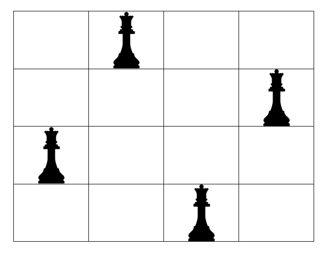

# 알고리즘 기본

> 작성자 : [권혁진](https://github.com/KimKwon), [박재용](https://github.com/ggjae), [서그림](https://github.com/Seogeurim)

<details>
<summary>Table of Contents</summary>

- [시간복잡도와 공간복잡도](#시간복잡도와-공간복잡도)
- [DFS와 BFS](#dfs와-bfs)
- [순열, 조합, 부분집합](#순열-조합-부분집합)
- [백트래킹 (Backtracking)](#백트래킹-backtracking)
  - [N-Queen](#N-Queen)
- [분할 정복법 (Divide and Conquer)](#분할-정복법-divide-and-conquer))
- [탐욕 알고리즘 (Greedy)](#탐욕-알고리즘-greedy)
- [동적 계획법 (Dynamic Programming)](#동적-계획법-dynamic-programming)
  - [0-1 Knapsack](#0-1-knapsack)

</details>

---

알고리즘은 **완전탐색**(**Brute-Force**, 모든 경우의 수를 탐색해보는 것)에서 시작한다. 이는 모든 경우의 수를 다 따져보기 때문에 강력하지만, 최대의 시간복잡도를 가지게 된다. 모든 경우의 수를 생각해보고 또한 시간복잡도를 줄일 수 있는 부분이 있다면 그러한 알고리즘을 생각해보고 그 알고리즘을 정확하게 코드로 구현할 수 있어야 한다. 좋은 코드를 짜기 위해서는 다음 과정의 연습이 필요하다.

- 문제를 파악하고 알고리즘을 생각하기
- 알고리즘의 공간복잡도와 시간복잡도를 계산하여 문제의 제약 조건 내에 수행될 수 있는 알고리즘인지 판단하기
- 알고리즘을 빠르고 정확하게 구현하기 (연습만이 정답)

## 시간복잡도와 공간복잡도

복잡도는 알고리즘의 성능을 나타내는 척도이다.  
복잡도는 **시간 복잡도(Time Complexity)** 와 **공간 복잡도(Space Complexity)** 로 나눌 수 있다.  
시간 복잡도는 특정한 크기의 입력에 대하여 알고리즘이 얼마나 오래 걸리는지를 의미하고 공간 복잡도는 특정한 크기의 입력에 대하여 알고리즘이 얼마나 많은 메모리를 차지하는지를 의미한다.  
동일한 기능을 수행하는 알고리즘이 있다면 일반적으로 복잡도가 낮을수록 좋은 알고리즘이다.  
복잡도의 측정으로 우리는 '알고리즘을 위해 필요한 연산의 횟수'로 시간 복잡도를 계산할 수 있고 '알고리즘을 위해 필요한 메모리의 양'으로 공간 복잡도를 계산할 수 있다.

### 시간 복잡도

보통 시간 복잡도를 표현할 때는 [Big-O 표기법(Big-O notation)](https://ko.wikipedia.org/wiki/%EC%A0%90%EA%B7%BC_%ED%91%9C%EA%B8%B0%EB%B2%95)을 사용한다. 가장 빠르게 증가하는 항만 고려하는 표기법으로 limit을 나타낸다.  
예를 들어 N개의 데이터가 있을 때 모든 데이터의 값을 더한 결과를 출력하는 프로그램이라면 N개의 데이터를 받아 차례로 N회 더해준다. 이 때 연산 횟수는 N에 비례하고 새로운 변수를 만들거나 출력하는 연산은 상대적으로 N이 커진다면 무시할 수 있게 된다. 가장 영향력이 큰 부분이 N으로 시간 복잡도를 O(N)으로 표시한다.  
일반적으로 코딩테스트에서는 최악의 경우에 대한 연산 횟수가 가장 중요하므로 자신이 작성한 소스코드를 정확히 이해하고 분석하여 최악의 경우의 시간 복잡도를 계산해야 한다.  
O(N<sup>3</sup>)을 넘어가면 문제 풀이에서 사용하기 어려운 알고리즘으로 N이 1000개를 넘어가면 5초 이상의 시간이 소요될 것이라고 예상할 수 있다.

- N의 범위가 500인 경우) 시간 복잡도가 O(N<sup>3</sup>)인 알고리즘을 설계하면 문제 해결 가능
- N의 범위가 2000인 경우) 시간 복잡도가 O(N<sup>2</sup>)인 알고리즘을 설계하면 문제 해결 가능
- N의 범위가 100,000인 경우) 시간 복잡도가 O(Nlog N)인 알고리즘을 설계하면 문제 해결 가능
- N의 범위가 10,000,000인 경우) 시간 복잡도가 O(N)인 알고리즘을 설계하면 문제 해결 가능

> 보통 1억(10<sup>8</sup>)번의 연산당 1초의 시간이 걸린다고 간주한다.

### 공간 복잡도

공간 복잡도를 표기할 때에도 [Big-O 표기법(Big-O notation)](https://ko.wikipedia.org/wiki/%EC%A0%90%EA%B7%BC_%ED%91%9C%EA%B8%B0%EB%B2%95)을 사용한다.  
코딩 테스트에서는 보통 메모리 사용량을 128~512MB로 제한하고 있다. 즉 일반적인 경우 데이터의 개수가 1,000만 단위를 넘어가지 않도록 알고리즘 설계를 해야하고 100만 개 이상의 데이터가 들어갈 수 있는 크기의 배열을 선언하는 경우는 거의 드물다.  
리스트의 크기가 1,000만 단위 이상이라면 자신이 알고리즘을 잘못 설계한 것이 아닌지 확인하는 과정이 필요하다.

일반적으로 알고리즘 문제 풀이에서의 복잡도는 시간 복잡도를 의미한다.

---

## DFS와 BFS

> 스터디 자료 - 작성자 권혁진 | [깊이우선탐색 DFS 에 대하여](https://nukw0n-dev.tistory.com/5)

### DFS(Depth First Search, 깊이 우선 탐색)

- 한 경로로 최대한 깊숙하게 들어가서 탐색한 후 다시 돌아가 다른 경로로 탐색하는 방식
- 재귀함수, Stack을 이용해 구현
- 유의할 점 : Stack Overflow (기저조건 잘 설정)
- 활용 : 백트래킹, 단절선/단절점 찾기, 위상정렬, 사이클 찾기 등

#### DFS 구현

```java
void dfs(int current) {
    if (current == target) { // 목적지인가?
        System.out.println("목적지입니다.");
        return;
    }
    visited[current] = true; // 체크인
    for (int next : graph[current]) { // 갈 수 있는 곳을 순회
        if (!visited[next]) { // 갈 수 있는가?
            dfs(next); // 간다
        }
    }
    visited[current] = false; // 체크아웃
}
```

### BFS(Breadth First Search, 너비 우선 탐색)

- 시작 노드에서 시작하여 인접한 노드를 먼저 탐색하는 방식, 여러 경로 동시에 탐색 가능
- Queue를 이용해 구현
- 유의할 점 : 메모리 초과 (방문 체크 꼭 해줘야 함)
- 활용 : 최단경로 찾기, 위상정렬 등

#### BFS 구현

```java
void bfs(int start) {
    Queue<Integer> q = new LinkedList<>();
    q.offer(start);
    visited[start] = true;

    while (!q.isEmpty()) {
        int current = q.poll(); // 큐에서 꺼낸다
        if (current == target) { // 목적지인가?
            System.out.println("목적지입니다.");
            return;
        }
        for (int next : graph[current]) { // 갈 수 있는 곳을 순회
            if (!visited[next]) { // 갈 수 있는가?
                visited[next] = true; // 체크인
                q.offer(next); // 큐에 넣는다
            }
        }
    }
}
```

---

## 순열, 조합, 부분집합

### 순열

- 서로 다른 것들 중 몇 개를 뽑아서 한 줄로 나열하는 것
- 서로 다른 n개 중 r개를 택하는 순열 `nPr = n * (n-1) * (n-2) * ... * (n-r+1)`
- `nPn = n!` 이며 `10!` 이상의 계산은 위험하다.

#### 순열 구현 : 재귀 함수, 비트마스크, next permutation

```java
public class PermutationTest {

    static int N;
    static int[] input, result;
    static boolean[] isSelected;

    public static void main(String[] args) {

        N = 5; // N 초기화
        input = new int[N]; // 입력 받은 숫자 배열
        result = new int[N]; // 순열 결과를 저장할 배열
        isSelected = new boolean[N]; // 선택 정보를 관리할 배열

        for (int i = 0; i < N; i++) {
            input[i] = i; // input 배열 초기화
        }

        System.out.println("Permutation Recursive");
        recursive(0);

        System.out.println("Permutation Bitmask");
        bitmask(0, 0);

        System.out.println("Permutation Next Permutation");
        Arrays.sort(input); // 오름차순 정렬하여 가장 작은 순열의 형태로 만듦
        do {
            System.out.println(Arrays.toString(input));
        } while (np());
    }

    // 재귀 함수
    private static void recursive(int cnt) {
        if (cnt == N) {
            System.out.println(Arrays.toString(result));
            return;
        }

        for (int i = 0; i < N; i++) {
            if (isSelected[i]) continue;

            result[cnt] = input[i];
            isSelected[i] = true;
            recursive(cnt+1);
            isSelected[i] = false;
        }
    }

    // 비트마스크
    private static void bitmask(int cnt, int flag) {
        if (cnt == N) {
            System.out.println(Arrays.toString(result));
            return;
        }

        for (int i = 0; i < N; i++) {
            if ((flag & 1<<i) != 0) continue;

            result[cnt] = input[i];
            bitmask(cnt+1, flag | 1<<i);
        }
    }

    // next permutation
    private static boolean np() {
        int i = N-1;
        while (i > 0 && input[i-1] >= input[i]) --i;

        // 더이상 앞자리가 없는 상황 : 현 순열의 상태가 가장 큰 순열 (마지막 순열)
        if (i == 0) return false;

        int j = N-1;
        while (input[i-1] >= input[j]) --j; // i-1보다 큰 값은 무조건 있음 (적어도 i)

        swap(i-1, j);

        int k = N-1;
        while (i < k) {
            swap(i++, k--);
        }

        return true;
    }

    private static void swap(int i, int j) {
        int temp = input[i];
        input[i] = input[j];
        input[j] = temp;
    }
}
```

### 조합

- 서로 다른 n개의 원소 중 r개를 **순서 없이** 골라낸 것
- 서로 다른 n개 중 r개를 택하는 조합 `nCr = n! / (n-r)!r!`

#### 조합 구현 : 재귀 함수, next permutation

```java
public class CombinationTest {

    static int N, R;
    static int[] input, result, P;

    public static void main(String[] args) {

        N = 5; // N 초기화
        R = 3;
        input = new int[N]; // 입력 받은 숫자 배열
        result = new int[R]; // 조합 결과를 저장할 배열

        for (int i = 0; i < N; i++) {
            input[i] = i; // input 배열 초기화
        }

        System.out.println("Combination Recursive");
        recursive(0, 0);

        System.out.println("Combination Next Permutation");
        P = new int[N]; // N 크기의 flag 배열
        // 원소 크기와 같은 크기의 int 배열 P를 생성하여 뒤에서 r개를 1로 초기화
        int cnt = 0;
        while (++cnt <= R) P[N-cnt] = 1;

        do {
            for (int i = 0; i < N; i++) {
                // P 배열에서 0이 아닌 값을 갖고 있는 위치에 해당하는 원소가 조합에 선택된 것
                if (P[i] == 1) System.out.print(input[i] + " ");
            }
            System.out.println();
        } while (np());
    }

    private static void recursive(int cnt, int start) {
        if (cnt == R) {
            System.out.println(Arrays.toString(result));
            return;
        }

        for (int i = start; i < N; i++) {
            result[cnt] = input[i];
            recursive(cnt+1, i+1);
        }
    }

    private static boolean np() {
        // STEP 1
        int i = N-1;
        while (i > 0 && P[i-1] >= P[i]) --i;

        if (i == 0) return false;

        // STEP 2
        int j = N-1;
        while (P[i-1] >= P[j]) --j;

        // STEP 3
        swap(i-1, j);

        // STEP 4
        int k = N-1;
        while (i < k) {
            swap(i++, k--);
        }

        return true;
    }

    private static void swap(int i, int j) {
        int temp = P[i];
        P[i] = P[j];
        P[j] = temp;
    }
}
```

### 부분집합

- 집합에 포함된 원소들을 선택하는 것
- 집합의 원소가 n개일 때, 공집합을 포함한 부분집합(멱집합, power set)의 개수는 2<sup>N</sup>개이다.
  (각 원소를 포함시키거나 / 포함시키지 않거나)

#### 부분집합 구현 : 재귀 함수, 바이너리 카운팅

```java
public class SubsetTest {

    static int N;
    static int[] input;
    static boolean[] isSelected;

    public static void main(String[] args) {

        N = 3; // N 초기화
        input = new int[N]; // 입력 받은 숫자 배열
        isSelected = new boolean[N]; // 선택 정보를 관리할 배열

        for (int i = 0; i < N; i++) {
            input[i] = i; // input 배열 초기화
        }

        System.out.println("Subset Recursive");
        recursive(0);

        System.out.println("Subset Binary Counting");
        binaryCounting(1<<N); // 2^N
    }

    private static void recursive(int cnt) {
        if (cnt == N) {
            for (int i = 0; i < N; i++) {
                System.out.print( (isSelected[i] ? input[i] : "X") + " ");
            }
            System.out.println();
            return;
        }

        // 선택
        isSelected[cnt] = true;
        recursive(cnt+1);
        // 비선택
        isSelected[cnt] = false;
        recursive(cnt+1);
    }

    private static void binaryCounting(int caseCount) {

        for (int flag = 0; flag < caseCount; flag++) { // flag : 비트마스크되어 있는 수
            for (int j = 0; j < N; j++) {
                if ((flag & 1<<j) != 0) {
                    System.out.print(input[j] + " ");
                } else {
                    System.out.print("X ");
                }
            }
            System.out.println();
        }
    }
}
```

---

## 백트래킹 (Backtracking)

백트래킹은 DFS 문제에서 모든 노드를 탐색할 필요가 없을 경우 적용한다. 다시 말해, 루트 노드에서 리프 노드까지의 경로는 해답 후보(candidate solution)가 되는데 이 때 모든 후보를 검사하지 않고 **후보가 아니라고 판단되면 더 이상 검색하지 않는다**.

### 백트래킹 알고리즘

> - 유망(promising)하다 : 어떤 노드를 방문하였을 때 그 노드를 포함한 경로가 해답이 될 수 있다.
> - 가지치기(pruning) : 유망하지 않은 노드가 포함되는 경로는 더 이상 고려하지 않는다.

1. 상태 공간 트리의 깊이 우선 탐색(DFS)을 실시한다.
2. 각 노드가 유망(promising)한지를 점검한다.
3. 만일 그 노드가 유망(promising)하지 않으면, 그 노드의 부모로 되돌아가(backtracking) 다음 자식 노드로의 검색을 계속한다.

백트래킹을 사용하면 **가지치기(pruning)** 를 통해 불필요한 경로를 차단하여 완전탐색(DFS)보다 경우의 수를 훨씬 줄일 수 있다. 대표적으로 N-Queen 문제가 백트래킹의 좋은 예시이다.

### N-Queen

N-Queen 문제는 N\*N 체스판에 퀸 N개를 서로 공격할 수 없게 놓는 문제를 말한다.
백트래킹 알고리즘이 N-Queen을 해결하는 가장 대표적인 알고리즘이다.

[BOJ 9663](https://www.acmicpc.net/problem/9663) 문제를 예시로 들어 설명을 해보겠다.

서로 공격할 수 없도록 퀸을 놓는 방법의 수를 구하는 문제이다.



위와 같이 배치하는 방법이 정답이 된다.

백트래킹을 사용하지 않고 이 문제를 해결하려면 N개의 퀸을 놓을 수 있는 모든 경우의 수를 시도해본 뒤 조건에 부합하는 지를 체크해보면 된다.

하지만 이러한 완전탐색 방식은 엄청나게 큰 시간복잡도를 갖는다.
모든 노드에 퀸을 놓아보는 경우의 수 `n*nCn`, 대각선/수직/수평에 퀸이 있는지 판단하는데 `O(N^2)`이니 시간복잡도가 터무니 없이 커짐을 알 수 있다.

> n값이 `10`만 되어도 17,310,309,456,440 개의 경우의 수를 갖는다.

N이 커질수록 시간복잡도 역시 기하급수적으로 증가하므로 너무나 **비효율적**이다.
이를 효율적으로 해결하기 위해 `백트래킹 알고리즘`을 사용한다.

먼저 **퀸의 특성**을 생각해보자.

1. 퀸은 수직선상에 있는 말을 공격할 수 있다.
2. 퀸은 수평선상에 있는 말을 공격할 수 있다.
3. 퀸은 대각선상에 있는 말을 공격할 수 있다.

이 특성을 통해 우리는 **퀸을 놓을 수 없는 자리**에 대해 판단할 수 있다.

1. 퀸은 한 row에 하나만 둘 수 있다.
2. 퀸은 한 column에 하나만 둘 수 있다.
3. 대각선에 퀸이 있다면 둘 수 없다.

이 과정이 **`유망성 판단`과 `가지치기`** 에 해당된다

`유망성 판단 조건1, 2`에 의해 2차원 체스판에서 모든 위치를 살필 필요 없이 `행` 혹은 `열` 단위로 확인하면 됨을 알 수 있다.

`행` 단위로 말을 놓으며 모든 행에 하나씩 퀸을 배치하도록 하는 백트래킹 함수를 정의해보자.

```cpp
int board[N]; // 각 행에 대해 퀸이 위치한 열의 번호를 기록하는 배열.

void bt(int rowNum) {
    if (rowNum == N) { // 모든 행에 말을 다 놓았다면 정답 개수를 하나 증가시킨다.
        answer++;
        return;
    }

    for (int colNum = 0; colNum < N; colNum++) {
    // 각 열에 대해 퀸을 놓을 수 있는지 확인한다.
        if (isPromissing(rowNum, colNum)) {
            board[rowNum] = colNum; // rowNum 행의 colNum 열에 퀸을 배치한다.
            bt(rowNum + 1); // 열의 번호를 하나 증가시키며 재귀 호출한다.
            board[rowNum] = 0;
        }
    }
}
```

이제 유망성을 판단하는 `isPromissing` 함수를 정의해보자.

위의 함수에 따라 하나의 `행`에는 하나의 퀸만 배치되는 것이 보장되므로 확인해야하는 것은 두가지이다.

1. 대각선 위치에 퀸이 존재하는가
2. 같은 열에 퀸이 존재하는가

```cpp
bool isPromising(int currentRow, int colNum) {
    for (int rowNum = 0; rowNum < currentRow; rowNum++) {
        if (board[rowNum] == colNum) return false;
        if (currentRow - rowNum == abs(colNum - board[rowNum])) return false;
    }
    return true;
}
```

현재 퀸을 놓을 수 있냐 없냐를 판단하고자 하는 위치는 `colNum` 행의 `currentRow` 열이다.

**_해당 위치의 대각선에 있는 노드란?_**

(x,y)와 대각선에 위치한 노드는 다음과 같다.

- (x+1, y+1), (x+2, y+2), (x+3, y+3) ...
- (x-1, y-1), (x-2, y-2), (x-3, y-3) ...

즉, **행 번호간 차이와 열 번호간 차이의 값이 같은** 노드가 대각선에 있는 노드라는 것을 알 수 있다.
이를 구현한 코드가 다음과 같다. (`isPromising` 함수의 두번째 조건문)

```cpp
if (currentRow - rowNum == abs(colNum - board[rowNum]))
```

---

## 분할 정복법 (Divide and Conquer)

분할 정복법은 전체 문제를 여러 개의 부분 문제들로 **분할** 각 부분 문제들을 해결(**정복**)함을 통해 전체 문제의 해답을 도출하는 방식이다. 이는 Top-down approach로 볼 수 있다.

- 분할 (Divide) : 해결할 문제를 여러 개의 작은 부분으로 (충분히 작아서 해결하기 쉬울 때까지) 나눈다.
- 정복 (Conquer) : 나눈 부분 문제를 각각 해결한다.
- 통합 (Combine) : 각 부분 문제의 해답을 모아서 전체 문제의 해답을 도출한다.

### 이분 탐색 (Binary Search)

> 이분 탐색 진행을 위해서는 자료가 정렬된 상태여야 한다.

정렬된 배열에서 특정 값 X를 찾고자 할 때, 이분 탐색을 이용하면 훨씬 빠르게 검색을 수행할 수 있다.

- Divide : 배열을 두 개의 부분 배열로 나눈다. X가 가운데에 있는 값보다 작으면 왼쪽 부분 배열을, 크면 오른쪽 부분 배열을 선택한다.
- Conquer : 배열의 가운데 값이 X와 같은지 비교한다. 같지 않다면 Divide 과정을 재귀적으로 수행한다.
- Combine : 부분 배열에서 찾은 답이 곧 전체 해답이다.

이 외에도 분할 정복법을 통해 MergeSort, QuickSort의 정렬 알고리즘을 구현할 수 있으며, 거듭제곱의 결과를 구할 때 시간복잡도를 줄일 수 있는 방법(2^8 -> 2를 8번 곱하기 vs ((2^2)^2)^2)으로 알려져 있기도 하다.

---

## 탐욕 알고리즘 (Greedy)

탐욕 알고리즘은 **최적해**를 구하는데 사용되는 근시안적인 방법이다. 최적화 문제(optimization)란 가능한 해들 중에서 가장 좋은 해를 찾는 문제이다. Greedy한 접근은 사람의 생각과 닮아 있다. **하나를 선택할 때마다 그 순간에 최적이라고 생각되는 것을 선택**하며, **한번 선택된 것은 번복하지 않는** 방식으로 진행하여 최종적인 해답에 도달하게 된다. 단, 최적해를 반드시 구한다는 보장이 없기 때문에 **증명 과정**이 필요하다.

> **최적해를 반드시 구한다는 보장이 없다.**
>
> 최소의 동전으로 800원을 만들고자 할 때, Greedy한 접근으로는 큰 동전부터 선택하면 될 것이다. 하지만 그랬을 때 최적해를 찾을 수 없는 경우도 있다.
>
> - 동전 종류가 500, 100, 50, 10일 경우 : 500원 1개, 100원 3개
> - 동전 종류가 500, 400, 100, 50, 10일 경우 : 500원 1개, 100원 3개 > 400원 2개

탐욕 알고리즘을 사용하기 위해서는 아래 두 가지 속성을 만족함을 증명해야 한다.

- **탐욕적 선택 속성 (greedy choice property)** : 탐욕적으로만 선택을 해도 최적해를 구할 수 있다.
- **최적 부분 구조 (optimal substructure property)** : 부분 문제의 최적해에서 전체 문제의 최적해를 만들 수 있다.

### 대표적인 탐욕 기법의 알고리즘

- 프림(Prim) 알고리즘 : 현재 정점에 연결된 간선들 중 가중치가 작은 간선부터 선택한다.
- 크루스칼(Kruskal) 알고리즘 : 각 단계에서 가중치가 작은 간선부터 선택한다.
- 다익스트라(Dijkstra) 알고리즘 : 현재 정점에서 가장 가까운 정점을 선택한다.

---

## 동적 계획법 (Dynamic Programming)

동적 계획법은 주어진 문제를 해결하기 위해 여러 개의 하위 문제로 나누어 푼 다음 결합하여 답을 찾는 방법이다. 문제 해결을 위해서는 다양한 방법으로 하위 문제로 나누어 보고 주어진 시간 복잡도 내에서 수행이 가능한 최적의 **점화식**을 찾는 것이 핵심이다.

동적 계획법을 적용한 대표적인 문제로는 배낭 짐싸기 문제(Knapsack Problem), 최장증가수열(LIS, Longest Increasing Subsequence), 외판원 순회 문제(TSP, Traveling Salesman Problem) 등이 있다. 이 밖에도 memoization 및 점화식을 통해 다양한 문제를 훨씬 효율적인 방식으로 해결할 수 있다.

> **"큰 문제를 여러개의 하위 문제로 나누어 푼다"** 라는 점에서
> DP는 그 하위의 값이 계속 변하고, DAC는 변하지 않는다는 차이점이 있다.

### 0-1 Knapsack

`Knapsack` 알고리즘은 크게 두가지로 나눌 수 있다.

1. Fractional Knapsack
2. 0-1 Knapsack

`Fractional Knapsack`의 경우 탐욕 기법을 사용해서 해결할 수 있다.
반면 `0-1 Knapsack`의 경우 탐욕 기법을 통해서는 _정해를 보장할 수 없고_ **동적 프로그래밍**을 사용해서 해결할 수 있다.

#### 0-1 Knapsack 이란 ?

1. N개의 보석이 있다.
2. 보석들은 각 보석마다 가격(V)과 무게를 가지고 있다.
3. 도둑이 보석을 훔치려고 한다! 하지만 도둑의 가방에는 정해진 무게(W) 밑으로만 담을 수 있다.
4. 도둑이 배낭 안에 담은 보석의 가격의 합이 최대가 되도록 하라.

동적 계획법의 기본적인 메커니즘에 의해, 이전 단계에서 구했던 최적해가 다음 단계에서 최적해를 구하는데 포함됨을 기억하며 점화식을 설계해보자.

```c
KNAPSACK(i, w) : 1~i 번호까지의 보석 중 배낭의 최대 무게가 w일 때의 가질 수 있는 최대의 보석가격합.
```

이러한 식을 설계한다고 했을 때, 우리가 원하는 최적해는 `KNAPSACK(N, W)`가 될 것이다.

배낭 무게를 1부터 W까지 늘려가며, 보석을 넣는다고 해보자.

이 때 다음 보석을 넣기 전 고려해야할 경우의 수가 3가지 있다.

1. 다음 보석을 배낭에 담을 수 없다.
2. 다음 보석을 배낭에 담을 수 있다.

   2-1. 다른 보석을 빼고 현재 보석을 담는다.
   
   2-2. 다른 보석과 함께 현재 보석을 담는다.

보석을 담을 수 없는 조건은 다음과 같다.

1. 현재 보석의 무게가 가방의 무게보다 무겁다.
2. 다른 보석을 빼고 넣은 무게가 이전 단계의 무게보다 가볍다.

`KNAPSACK(N, W)`는 결국 `KNAPSACK(N-1, w)`와 연관을 갖게 된다.
즉, 이전 보석 번호의 최적해 값을 사용하여 구하게 되는 것이다.

위의 조건들을 고려하여 점화식을 세워볼 수 있겠다.

```c
                 (if w[i] > w) KNAPSACK(i-1, w)
KNAPSACK(i, w) =
                 (if w[i] <= w) max(KNAPSACK(i-1, w), KNAPSACK(i-1, w-w[i]) + V[i])
```

위의 점화식을 사용해 보석 번호 1부터 N까지, 배낭 무게를 1부터 W까지 반복하며 이차원 배열을 채워나가면 된다.

이러한 풀이방법을 사용한다면 배낭문제를 `O(N*W)`의 시간복잡도로 해결 할 수 있게 된다.
