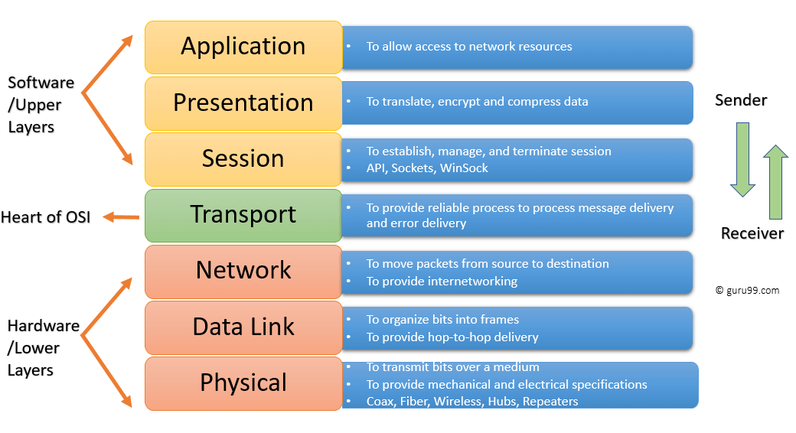
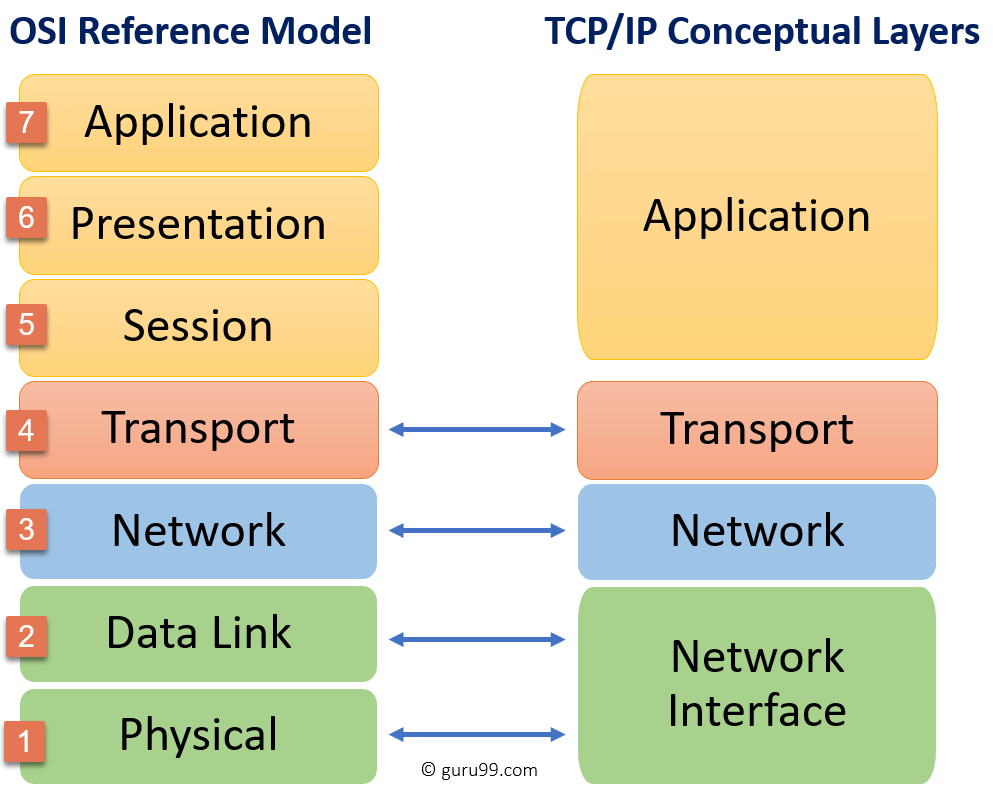

# Network (네트워크)

> 작성자 : [권혁진](https://github.com/KimKwon), [서그림](https://github.com/Seogeurim), [윤가영](https://github.com/yoongoing)

## OSI 7 계층

> 개방형 시스템 상호 연결을 위한 기초 참조 모델(Open Systems Interconnection Reference Model)

OSI 7 계층이란, 국제표준화기구(ISO)에서 개발한 모델로, 컴퓨터 네트워크 프로토콜 디자인과 통신을 계층으로 나누어 설명한 것이다.

쉽게 말하면 **네트워크에서 통신이 일어나는 과정을 7단계로 나눈 것**을 말한다. 계층 모델에 의해 **프로토콜도 계층별로 구성**된다. 현재 네트워크 시스템의 기반이 된 모델이며 다양한 시스템은 이 계층 모델을 기반으로 통신한다. (현재의 인터넷은 각 계층의 역할들이 합쳐지면서 TCP/IP 4 계층 모델을 기반으로 한다.)

OSI 7 계층을 나눈 이유는 **통신이 일어나는 과정을 단계별로 알 수 있고, 7단계 중 특정한 곳에 이상이 생기면 다른 단계와 독립적으로 그 단계만 수정할 수 있기 때문**이다.

OSI 7 계층은 **물리 계층, 데이터 링크 계층, 네트워크 계층, 전송 계층, 세션 계층, 표현 계층, 응용 계층**으로 구성되어 있다.

### 프로토콜이란

위에서 프로토콜이 계층별로 구성된다고 언급하였다. 이 프로토콜이란, 메시지를 주고 받는 양식이나 규칙을 의미하는 **통신 규약**이다.

시스템 간 메시지를 주고 받기 위해서는 한쪽에서 보낸 메시지를 반대쪽에서 이해할 수 있어야 한다. 한쪽에서 '안녕' 이라는 메시지를 보냈을 때, 
인사로 알아듣고 대답으로 '안녕' 이라는 메시지를 보낼 수 있어야 한다는 뜻이다. 통신 모델에서도 메시지를 주고 받으며 통신할 때 그 언어와 대화 방법에 
대한 규칙이 있어야 의사소통을 할 수 있을 것이다. 이 규칙을 정의한 것이 프로토콜이고, 이 규칙은 계층별로 다르게 존재한다.

### OSI 7 계층의 구조

- **[7] 응용 계층 (Application Layer) : 데이터 단위 message | 프로토콜 HTTP, SMTP, FTP, SIP 등**
  - 통신의 최종 목적지로, 응용 프로그램들이 통신으로 활용하는 계층이다.
  - 사용자에게 가장 가까운 계층이며 웹 브라우저, 응용 프로그램을 통해 사용자와 직접적으로 상호작용한다.
  - 많은 프로토콜이 존재하는 계층으로, 새로운 프로토콜 추가도 굉장히 쉽다.
- **[6] 표현 계층 (Presentation Layer) : 데이터 단위 message | 프로토콜 ASCII, MPEG 등**
  - 데이터의 암호화, 복호화와 같이 응용 계층에서 교환되는 데이터의 의미를 해석하는 계층이다.
  - 응용 프로그램 ↔ 네트워크 간 정해진 형식대로 데이터를 변환, 즉 표현한다.
  - 인터넷의 계층 구조에는 포함되어있지 않으며 필요에 따라 응용 계층에서 지원하거나 어플리케이션 개발자가 직접 개발해야 한다.
- **[5] 세션 계층 (Session Layer) : 데이터 단위 message | 프로토콜 NetBIOS, TLS 등**
  - 데이터 교환의 경계와 동기화를 제공하는 계층이다.
  - 세션 계층의 프로토콜은 연결이 손실되는 경우 연결 복구를 시도한다. 오랜 시간 연결이 되지 않으면 세션 계층의 프로토콜이 연결을 닫고 다시 연결을 재개한다.
  - 데이터를 상대방이 보내고 있을 때 동시에 보낼지에 대한 전이중(동시에 보냄, 전화기), 반이중(동시에 보내지 않음, 무전기) 통신을 결정할 수 있다.
  - 인터넷의 계층 구조에는 포함되어있지 않으며 필요에 따라 응용 계층에서 지원하거나 어플리케이션 개발자가 직접 개발해야 한다.
- **[4] 전송 계층 (Transport Layer) : 데이터 단위 segment | 프로토콜 TCP, UDP, SCTP 등**
  - 상위 계층의 메시지를 하위 계층으로 전송하는 계층이다.
  - 메시지의 오류를 제어하며, 메시지가 클 경우 이를 나눠서(Segmentation) 네트워크 계층으로 전달한다. 그리고 받은 패킷을 재조립해서 상위 계층으로 전달한다. 
  - 대표적으로 TCP, UDP 프로토콜이 있다. TCP는 연결 지향형 통신을, UDP는 비연결형 통신을 제공한다.
- **[3] 네트워크 계층 (Network Layer) : 데이터 단위 datagram, packet | 프로토콜 IP, ICMP, ARP, RIP, BGP 등**
  - 패킷을 한 호스트에서 다른 호스트로 라우팅하는 계층이다. (여러 라우터를 통한 라우팅, 그를 통한 패킷 전달)
  - 전송 계층에게 전달 받은 목적지 주소를 이용해서 패킷을 만들고 그 목적지의 전송 계층으로 패킷을 전달한다.
  - 인터넷의 경우 IP 프로토콜이 대표적이다.
- **[2] 데이터 링크 계층 (Data Link Layer) : 데이터 단위 frame | 프로토콜 PPP, Ethernet, Token ring, IEE 802.11(Wifi) 등**
  - 데이터를 frame 단위로 한 네트워크 요소에서 이웃 네트워크 요소로 전송하는 계층이다. (물리 계층을 이용해 전송)
  - 인터넷의 경우 Ethernet 프로토콜이 대표적이다. Ethernet은 MAC 주소를 이용해 Node-to-Node, Point-to-Point로 프레임을 전송한다.
  - 이 계층의 장비로 대표적인 것은 스위치, 브릿지이다.
- **[1] 물리 계층 (Physical Layer) : 데이터 단위 bit | 프로토콜 DSL, ISDN 등**
  - 장치 간 전기적 신호를 전달하는 계층이며, 데이터 프레임 내부의 각 bit를 한 노드에서 다음 노드로 실제로 이동시키는 계층이다.
  - 인터넷의 Ethernet 또한 여러가지 물리 계층 프로토콜을 갖고 있다.
  - 이 계층의 장비로 대표적인 것은 허브, 리피터이다.

---

## HTTP 요청 방식

## TCP 3-way-handshake & 4-way-handshake

## TCP 와 UDP

아래의 자료에서 자세한 설명과 코드를 볼 수 있다.

- 작성자 권혁진 | [TCP 와 UDP](https://nukw0n-dev.tistory.com/10)

## HTTP 와 HTTPS

## DNS round robin 방식과 웹 통신의 흐름

아래의 자료에서 자세한 설명과 코드를 볼 수 있다.

- 작성자 윤가영 | [DNS round robin & network flow](./materials/yoongoing_networkflow.pdf)

---

## 질의응답

> 아직 없습니다.
