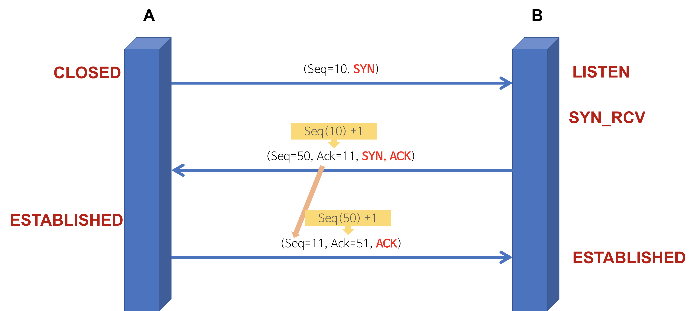

# Network (네트워크)

> 작성자 : [권혁진](https://github.com/KimKwon), [서그림](https://github.com/Seogeurim), [윤가영](https://github.com/yoongoing)

Table of Contents

- [OSI 7 계층](#osi-7-계층)
- [TCP 3-way-handshake & 4-way-handshake](#tcp-3-way-handshake--4-way-handshake)
- [TCP 와 UDP](#tcp-와-udp)
- [HTTP 요청 방식 - GET, POST](#http-요청-방식---get-post)
- [HTTP 와 HTTPS](#http-와-https)
- [DNS round robin 방식과 웹 통신의 흐름](#dns-round-robin-방식과-웹-통신의-흐름)

---

## OSI 7 계층

> 개방형 시스템 상호 연결을 위한 기초 참조 모델(Open Systems Interconnection Reference Model)

OSI 7 계층이란, 국제표준화기구(ISO)에서 개발한 모델로, 컴퓨터 네트워크 프로토콜 디자인과 통신을 계층으로 나누어 설명한 것이다.

쉽게 말하면 **네트워크에서 통신이 일어나는 과정을 7단계로 나눈 것**을 말한다. 계층 모델에 의해 **프로토콜도 계층별로 구성**된다. 현재 네트워크 시스템의 기반이 된 모델이며 다양한 시스템은 이 계층 모델을 기반으로 통신한다. (현재의 인터넷은 각 계층의 역할들이 합쳐지면서 TCP/IP 4 계층 모델(링크 계층, 인터넷 계층, 전송 계층, 응용 계층)을 기반으로 한다.)

> 현재의 인터넷 계층 모델 참조 : [RFC1122 공식 문서 - Internet Protocol Suite](https://tools.ietf.org/html/rfc1122)

OSI 7 계층을 나눈 이유는 **통신이 일어나는 과정을 단계별로 알 수 있고, 7단계 중 특정한 곳에 이상이 생기면 다른 단계와 독립적으로 그 단계만 수정할 수 있기 때문**이다.

OSI 7 계층은 **물리 계층, 데이터 링크 계층, 네트워크 계층, 전송 계층, 세션 계층, 표현 계층, 응용 계층**으로 구성되어 있다.

### 프로토콜이란

위에서 프로토콜이 계층별로 구성된다고 언급하였다. 이 프로토콜이란 메시지를 주고 받는 양식이나 규칙을 의미하는 **통신 규약**이다.

시스템 간 메시지를 주고 받기 위해서는 한쪽에서 보낸 메시지를 반대쪽에서 이해할 수 있어야 한다. 한쪽에서 '안녕' 이라는 메시지를 보냈을 때 
인사로 알아듣고 대답으로 '안녕' 이라는 메시지를 보낼 수 있어야 한다는 뜻이다. 통신 모델에서도 메시지를 주고 받으며 통신할 때 그 언어와 대화 방법에 
대한 규칙이 있어야 의사소통을 할 수 있을 것이다. 이 규칙을 정의한 것이 프로토콜이고 이 규칙은 계층별로 다르게 존재한다.

### OSI 7 계층의 구조

 

#### \[7] 응용 계층 (Application Layer) : 데이터 단위 message | 프로토콜 HTTP, SMTP, FTP, SIP 등

- 통신의 최종 목적지로, 응용 프로그램들이 통신으로 활용하는 계층이다.
- 사용자에게 가장 가까운 계층이며 웹 브라우저, 응용 프로그램을 통해 사용자와 직접적으로 상호작용한다.
- 많은 프로토콜이 존재하는 계층으로, 새로운 프로토콜 추가도 굉장히 쉽다.

#### \[6] 표현 계층 (Presentation Layer) : 데이터 단위 message | 프로토콜 ASCII, MPEG 등

- 데이터의 암호화, 복호화와 같이 응용 계층에서 교환되는 데이터의 의미를 해석하는 계층이다.
- 응용 프로그램 ⇔ 네트워크 간 정해진 형식대로 데이터를 변환, 즉 표현한다.
- 인터넷의 계층 구조에는 포함되어있지 않으며 필요에 따라 응용 계층에서 지원하거나 어플리케이션 개발자가 직접 개발해야 한다.

#### \[5] 세션 계층 (Session Layer) : 데이터 단위 message | 프로토콜 NetBIOS, TLS 등

- 데이터 교환의 경계와 동기화를 제공하는 계층이다.
- 세션 계층의 프로토콜은 연결이 손실되는 경우 연결 복구를 시도한다. 오랜 시간 연결이 되지 않으면 세션 계층의 프로토콜이 연결을 닫고 다시 연결을 재개한다.
- 데이터를 상대방이 보내고 있을 때 동시에 보낼지에 대한 전이중(동시에 보냄, 전화기), 반이중(동시에 보내지 않음, 무전기) 통신을 결정할 수 있다.
- 인터넷의 계층 구조에는 포함되어있지 않으며 필요에 따라 응용 계층에서 지원하거나 어플리케이션 개발자가 직접 개발해야 한다.

#### \[4] 전송 계층 (Transport Layer) : 데이터 단위 segment | 프로토콜 TCP, UDP, SCTP 등

- 상위 계층의 메시지를 하위 계층으로 전송하는 계층이다.
- 메시지의 오류를 제어하며, 메시지가 클 경우 이를 나눠서(Segmentation) 네트워크 계층으로 전달한다. 그리고 받은 패킷을 재조립해서 상위 계층으로 전달한다. 
- 대표적으로 TCP, UDP 프로토콜이 있다. TCP는 연결 지향형 통신을, UDP는 비연결형 통신을 제공한다.

#### \[3] 네트워크 계층 (Network Layer) : 데이터 단위 datagram, packet | 프로토콜 IP, ICMP, ARP, RIP, BGP 등

- 패킷을 한 호스트에서 다른 호스트로 라우팅하는 계층이다. (여러 라우터를 통한 라우팅, 그를 통한 패킷 전달)
- 전송 계층에게 전달 받은 목적지 주소를 이용해서 패킷을 만들고 그 목적지의 전송 계층으로 패킷을 전달한다.
- 인터넷의 경우 IP 프로토콜이 대표적이다.

#### \[2] 데이터 링크 계층 (Data Link Layer) : 데이터 단위 frame | 프로토콜 PPP, Ethernet, Token ring, IEE 802.11(Wifi) 등

- 데이터를 frame 단위로 한 네트워크 요소에서 이웃 네트워크 요소로 전송하는 계층이다. (물리 계층을 이용해 전송)
- 인터넷의 경우 Ethernet 프로토콜이 대표적이다. Ethernet은 MAC 주소를 이용해 Node-to-Node, Point-to-Point로 프레임을 전송한다.
- 이 계층의 장비로 대표적인 것은 스위치, 브릿지이다.

#### \[1] 물리 계층 (Physical Layer) : 데이터 단위 bit | 프로토콜 DSL, ISDN 등

- 장치 간 전기적 신호를 전달하는 계층이며, 데이터 프레임 내부의 각 bit를 한 노드에서 다음 노드로 실제로 이동시키는 계층이다.
- 인터넷의 Ethernet 또한 여러가지 물리 계층 프로토콜을 갖고 있다.
- 이 계층의 장비로 대표적인 것은 허브, 리피터이다.

---

## TCP 3-way-handshake & 4-way-handshake

> 참고 : [[Network] TCP 3-way handshaking과 4-way handshaking](https://gmlwjd9405.github.io/2018/09/19/tcp-connection.html)

TCP는 네트워크 계층 중 **전송 계층에서 사용하는 프로토콜** 중 하나로, **신뢰성을 보장하는 연결형 서비스**이다.

TCP의 **3-way-handshake**란 TCP 통신을 시작하기 전에 논리적인 경로 **연결을 수립 (Connection Establish)** 하는 과정이며, **4-way-handshake**는 논리적인 경로 **연결을 해제 (Connection Termination)** 하는 과정이다. 이러한 방식을 Connect Oriented 방식이라 부르기도 한다.

### TCP 3-way-handshake : Connection Establish

3-way-handshake 과정을 통해 양쪽 모두 데이터를 전송할 준비가 되었다는 것을 보장한다.

#### A 프로세스(Client)가 B 프로세스(Server)에 연결을 요청

1. **A**(CLOSED) **→ B**(LISTEN) **: SYN(a)**
    - 프로세스 A가 연결 요청 메시지 전송 (SYN)
    - 이 때 Sequence Number를 임의의 랜덤 숫자(a)로 지정하고, SYN 플래그 비트를 1로 설정한 segment를 전송한다.
2. **B**(SYN_RCV) **→ A**(CLOSED) **: ACK(a+1), SYN(b)**
    - 연결 요청 메시지를 받은 프로세스 B는 요청을 수락(ACK)했으며, 요청한 A 프로세스도 포트를 열어달라(SYN)는 메시지 전송
    - 받은 메시지에 대한 수락에 대해서는 Acknowledgement Number 필드를 (Sequence Number + 1)로 지정하여 표현한다. 그리고 SYN과 ACK 플래그 비트를 1로 설정한 segment를 전송한다.
3. **A**(ESTABLISHED) **→ B**(SYN_RCV) **: ACK(b+1)**
    - 마지막으로 프로세스 A가 수락 확인을 보내 연결을 맺음 (ACK)
    - 이 때, 전송할 데이터가 있으면 이 단계에서 데이터를 전송할 수 있다.

최종 PORT 상태 : A-ESTABLISHED, B-ESTABLISHED (연결 수립)

### TCP 4-way-handshake : Connection Termination

#### A 프로세스(Client)가 B 프로세스(Server)에 연결 해제를 요청

1. **A**(ESTABLISHED) **→ B**(ESTABLISHED) **: FIN**
    - 프로세스 A가 연결을 종료하겠다는 FIN 플래그를 전송
    - 프로세스 B가 FIN 플래그로 응답하기 전까지 연결을 계속 유지
2. **B**(CLOSE_WAIT) **→ A**(FIN_WAIT_1) **: ACK**
    - 프로세스 B는 일단 확인 메시지(ACK)를 보내고 자신의 통신이 끝날 때까지 기다린다.
    - Acknowledgement Number 필드를 (Sequence Number + 1)로 지정하고, ACK 플래그 비트를 1로 설정한 segment를 전송한다.
    - 그리고 자신이 전송할 데이터가 남아있다면 이어서 계속 전송한다. (클라이언트 쪽에서도 아직 서버로부터 받지 못한 데이터가 있을 것을 대비해 일정 시간동안 세션을 남겨놓고 패킷을 기다린다. 이를 TIME_WAIT 상태라고 한다.)
3. **B**(CLOSE_WAIT) **→ A**(FIN_WAIT_2) **: FIN**
    - 프로세스 B의 통신이 끝나면 이제 연결 종료해도 괜찮다는 의미로 프로세스 A에게 FIN 플래그를 전송한다.
4. **A**(TIME_WAIT) **→ B**(LAST_ACK) **: ACK**
    - 프로세스 A는 FIN 메시지를 확인했다는 메시지를 전송 (ACK)
    - 프로세스 A로부터 ACK 메시지를 받은 프로세스 B는 소켓 연결을 해제한다.

최종 PORT 상태 : A-CLOSED, B-CLOSED (연결 해제)
    
---

## TCP 와 UDP

아래의 자료에서 자세한 설명과 코드를 볼 수 있다.

- 작성자 권혁진 | [TCP 와 UDP](https://nukw0n-dev.tistory.com/10)

---

## HTTP 요청 방식 - GET, POST

HTTP의 GET, POST 메서드란 HTTP 프로토콜을 이용해서 서버에 데이터(요청 정보)를 전달할 때 사용하는 방식이다.

### HTTP GET 메서드

GET 메서드는 **정보를 조회**하기 위한 메서드로, 서버에서 어떤 데이터를 가져와서 보여주기 위한 용도의 메서드이다. **"가져오는 것(Select)"**

GET 방식은 요청하는 데이터가 HTTP Request Message의 Header 부분의 url에 담겨서 전송된다. 이는 요청 정보를 url 상에 넣어야 한다는 뜻이다. 요청 정보를 url에 넣는 방법은 요청하려는 url의 끝에 `?`를 붙이고, `(key=value)` 형태로 요청 정보를 담으면 된다. 요청 정보가 여러 개일 경우에는 `&`로 구분한다.

> ex. `www.urladdress.xyz?name1=value1&name2=value2`, `www.google.com/search?q=서그림`

GET 방식은 게시판의 게시글 조회 기능처럼 데이터를 조회할 때 쓰이며 서버의 상태를 바꾸지 않는다. 예외적으로 방문자의 로그 남기기 기능이나 글을 읽은 횟수 증가 기능에도 쓰인다.

GET 방식은 다음과 같은 특징이 있다.

- url에 요청 정보가 이어붙기 때문에 전송할 수 있는 데이터의 크기가 제한적이다. (주솟값 + 파라미터 해서 255자로 제한된다. HTTP/1.1은 2048자)
- HTTP 패킷의 Body는 비어 있는 상태로 전송한다. 즉, Body의 데이터 타입을 표현하는 Content-Type 필드도 HTTP Request Header에 들어가지 않는다.
- 요청 데이터가 그대로 url에 노출되므로 사용자가 쉽게 눈으로 확인할 수 있어 POST 방식보다 보안상 취약하다. 보안이 필요한 데이터는 GET 방식이 적절하지 않다.
- GET 방식은 멱등성(Idempotent, 연산을 여러 번 적용하더라도 결과가 달라지지 않는 성질)이 적용된다.
- GET 방식은 캐싱을 사용할 수 있어, GET 요청과 그에 대한 응답이 브라우저에 의해 캐쉬된다. 따라서 POST 방식보다 빠르다.

> GET 방식의 캐싱 : 서버에 리소스를 요청할 때 웹 캐시가 요청을 가로채 서버로부터 리소스를 다시 다운로드하는 대신 리소스의 복사본을 반환한다. HTTP 헤더에서 cache-control 헤더를 통해 캐시 옵션을 지정할 수 있다.
> _(출처: [\[네트워크\] get 과 post 의 차이](https://noahlogs.tistory.com/35))_

### HTTP POST 메서드

POST 메서드는 서버의 값이나 상태를 바꾸기 위한 용도의 메서드이다. **"수행하는 것(Insert, Update, Delete)"**

POST 방식은 요청하는 데이터가 HTTP Request Message의 Body 부분에 담겨서 전송된다. Request Header의 Content-Type에 해당 데이터 타입이 표현되며, 전송하고자 하는 데이터 타입을 적어주어야 한다.

- Default : application/octet-stream
- 단순 txt : text/plain
- 파일 : multipart/form-data

POST 방식은 게시판 글쓰기 기능처럼 서버의 데이터를 업데이트할 때 쓰인다.

POST 방식은 다음과 같은 특징이 있다.

- Body 안에 데이터를 담아 전송하기 때문에 대용량의 데이터를 전송하기에 적합하다.
- GET 방식보다 보안상 안전하지만, 암호화를 하지 않는 이상 보안에 취약한 것은 같다.
- 클라이언트 쪽에서 데이터를 인코딩하여 서버로 전송하고, 이를 받은 서버 쪽이 해당 데이터를 디코딩한다.

> **목적에 맞는 기술을 사용해야 한다. - GET 방식의 캐싱과 연관지어 생각해보기**
>
> GET 방식의 요청은 브라우저에서 캐싱을 할 수 있다고 했다. 때문에 POST 방식으로 요청해야 할 것을, 요청 데이터의 크기가 작고 보안적인 문제가 없다는 이유로 GET 방식으로 요청한다면 기존에 캐싱되었던 데이터가 응답될 가능성이 존재한다. 때문에 목적에 맞는 기술을 사용해야 한다.

---

## HTTP 와 HTTPS

아래의 자료에서 자세한 설명과 코드를 볼 수 있다.

- 작성자 권혁진 | [HTTP와 HTTPS](https://nukw0n-dev.tistory.com/11?category=940859)

---

## DNS round robin 방식과 웹 통신의 흐름

아래의 자료에서 자세한 설명과 코드를 볼 수 있다.

- 작성자 윤가영 | [DNS round robin & network flow](./materials/yoongoing_networkflow.pdf)

---

## 질의응답

_질문에 대한 답을 말해보며 공부한 내용을 점검할 수 있으며, 클릭하면 답변 내용을 확인할 수 있습니다._

OSI 7계층을 택하면 좋은점이 무엇일까요?
 

1. 네트워크 통신이 일어나는 과정을 단계별로 살필 수 있기 때문에 문제 원인의 범위를 좁힐 수 있어 효율적이다.
2. 장비 간 호환성을 제공하며 네트워크 장치/컴퓨팅 장치를 만들 때의 참조모델 표준이 될 수 있다.

많은 직장인들이 아웃룩을 이용하여 회사 메일을 관리하고 있습니다. 아웃룩과 관련된 계층과 프로토콜을 말해주세요.

- 계층 : 7계층, Application Layer
- 프로토콜 : SMTP, POP3

아웃룩은 메시지 프로토콜을 사용하기 쉽게하는 응용프로그램이다.

이전에 저희 회사의 서비스를 제공받는 모든 고객의 pc에서 서비스 중단 이 일어났습니다. OSI 7계층의 관점으로 몇번째 계층의 문제임을 예상할 수 있을까요?

한명의 고객이 아닌, “모든 고객의 pc”에서 문제가 생겼으므로, `1계층` 혹은 `3계층`에 문제가 있음을 예상할 수 있다.

서버에 문제가 생겼는데, Ping Test 시 문제는 없었습니다. 그렇다면 어느 계층에서 문제가 있다는 것을 유추할 수 있나요?

Ping Test는 3계층(네트워크 레이어)에 속한다. 즉, 4계층 ~ 7계층 사이에서 문제가 발생한 것으로 유추할 수 있다.

유튜브와 같은 스트리밍 서비스를 제작해보려합니다. 이때 어떤 프로토콜로 구현할 것인지 관련 계층과 연관지어 말해주세요.

의도한 답 : 스트리밍에서는 연속성이 중요하기 때문에 신뢰도는 낮지만 빠른 4계층 transport layer의 `UDP 프로토콜`을 사용하여 구현하겠습니다.

---

http 프로토콜을 사용하여 개발한 경험이 있다면 말씀해주세요.

정해진 답 없음.

http는 연결성일까요, 비 연결성일까요? 근거를 들어 말해주세요.

비연결성이다.

`비연결성`이란 클라이언트와 서버가 한 번 연결을 맺은 후, 클라이언트 요청에 대해 서버가 응답을 마치면 맺었던 연결을 끊어 버리는 성질을 말한다.

하지만 다수의 클라이언트와 서버간의 연결상태를 유지하려면 자원이 많이 필요하다. HTTP는 다수의 클라이언트가 웹 서버에 요청하는 방식을 띄므로 연결지속에 필요한 자원을 줄여 더 많은 `Connection` 을 수립하는 것에 중점을 둔다.

비 연결성의 장점은 무엇인가요?

서버에서 다수의 클라이언트와 연결을 유지한다면, 그만큼 리소스가 많이 필요하게 된다. 비연결성이면, 이에 따른 리소스를 줄여 더 많은 연결을 할 수 있다.

비 연결성의 단점은 무엇이고, 해결법은 무엇인가요?

서버가 클라이언트를 기억하고 있지 않아 동일한 클라이언트의 요청에 대해 매번 연결 시도/해제의 작업을 해야하므로 오버헤드가 증가한다.

기본적으로 HTTP Header에는 `Keep-Alive` 속성이 있는데, 이를 통해 연결에 대한 타임아웃을 지정할 수 있다.

연결성외에 클라이언트의 상태 정보를 저장하기 위해서는 `Cookie`, `Token`, `Session` 을 사용하기도한다.

데이터를 조회하기 위한 용도로 POST가 아닌 GET 방식을 사용하는 이유는 무엇인가요?

1. 설계 원칙에 따라 GET 방식은 서버에게 여러 번 요청을 하더라도 동일한 응답이 돌아와야 한다. (멱등성)
    - GET 방식은 "가져오는 것"으로, 서버의 데이터나 상태를 변경시키지 않아야 한다.  
      (ex. 게시판의 리스트, 게시글 보기 기능 | 예외. 방문자의 로그 남기기, 글을 읽은 횟수 증가 기능)
    - POST 방식은 "수행하는 것"으로, 서버의 값이나 상태를 바꾸기 위한 용도이다.  
      (ex. 게시판에 글쓰기 기능)
2. 웹에서 모든 리소스는 Link할 수 있는 url을 가지고 있어야 한다.
    - 어떤 웹페이지를 조회할 때 원하는 페이지로 바로 이동하거나 이동시키기 위해서는 해당 링크의 정보가 필요하다.
    - 만일 POST 방식을 사용한다면, 링크의 정보가 Body에 있기 때문에 url만 전달할 수 없으므로 GET 방식을 사용해야 한다. 글을 저장하는 경우에는 URL을 제공할 필요가 없기 때문에 POST 방식을 사용한다.

웹 애플리케이션 제작 시 조회/삭제/수정의 업무를 하려고합니다. 각각을 어떤 방식으로 설계할 것인지 말해주세요.

    
의도한 답 : 조회는 `GET`, 삭제는 `DETELE`, 수정은 `POST`로 설계할 것이다. GET은 조회하기 위한 메서드로 `멱등성`을 만족하기 위해 데이터의 수정이 없어야하며, POST는 서버의 값 혹은 상태를 변경하기 위한 메서드로 수정하기 위해 사용한다. RESTful API에 근거하여 삭제는 DELETE로 설계한다.  

---

TCP의 특성에 대해서 말씀해주세요. 

TCP는 `Transfer Control Protocol`로 4계층 Transport Layer에 속하는 프로토콜이다.
1. `3-way Handshaking`을 통해 논리적인 경로의 연결을 수립하고 `4-way Handshaking`을 통해 논리적인 경로의 연결을 해제하는 `Connect Oriented` 즉, 연결지향성 프로토콜이다.
2. 혼잡제어, 흐름제어 기능을 제공한다.
3. `Reliable Data Transfer(=RDT)` 즉, 신뢰성 있는 전송을 지원한다. RDT1.0 ~ RDT3.0 등으로 발전해왔으며 `Go-Back-N`, `Selective Repeat`, `타이머`를 통한 timeout 등 다양한 방식이 있다.
4. HTTP, E-mail, File Transfer 등에 사용된다.

UDP의 특성에 대해서 말씀해주세요. 

UDP는 `User Datagram Protocol`로 TCP와 같이 전송계층에 속해있으나 갖는 특징이 조금 다르다.

1. 비연결형, `Connectionless` 프로토콜이다. TCP와 같은 Handshaking 절차가 존재하지 않는다.
2. TCP에서 지원하는 흐름제어, 혼잡제어, 순서보장, 전송보장 기능을 제공하지 않는다.
3. 최소한의 오류검출을 위해 `checksum` 을 활용한다.
4. TCP에 비해 빠른 속도와 적은 부하를 갖기에 `실시간 스트리밍`, `DNS`에 사용하기 적합하다.

---

<!-- 4월 3주차 CS면접 주제 : [Network] HTTP와 HTTPS, DNS, 웹 통신 흐름 -->
<!-- 여기 HTTP & HTTPS -->

---

<!-- DNS -->

DNS 서버는 무슨 역할을 하나요?

DNS 시스템은 ip주소와 도메인 이름의 매핑을 관리합니다. DNS 서버는 ip 주소와 도메인 간의 변환 작업을 수행하며, 사용자가 도메인 이름을 웹 브라우저에 입력하면 해당 사용자를 어떤 서버에 연결할 것인지를 제어하는 역할을 합니다.

도메인과 ip 주소에 대해서 설명해보세요.

인터넷은 서버들을 유일하게 구분할 수 있는 ip 주소를 기본 체계로 이용합니다. 하지만 ip 주소는 숫자로 이루어진 조합이라 인간이 기억하기엔 무리가 있습니다. 따라서 우리는 기억하기 편한 언어 체계의 도메인 이름을 통해 웹 서버에 접속합니다.

도메인의 구조에 대해서 설명해주세요.

도메인은 .(dot) 또는 루트(root)라고 불리는 도메인 이하에 Inverted tree 구조로 구성되어 있습니다. 1단계부터 차례대로 TLD(Top Level Domain), SLD(Second Level Domain), SubDomain이라고 합니다.

DNS 서버의 Recursive Query 과정을 설명해주세요.

로컬 DNS 서버가 여러 DNS 서버를 차례대로 (루트 → com → naver.com DNS 서버) 질의해서 ip 주소를 찾아가는 과정을 말합니다.

---

<!-- 웹 통신 흐름 -->

인터넷에 <code>www.naver.com</code>을 쳤을 때, 브라우저의 렌더링 과정에 대해 설명해주세요.

1. 로컬 DNS 서버에게 `www.naver.com`에 해당하는 ip 주소가 있는지 물어본다. 있다면 바로 해당 ip로 받아온다.
2. 없다면, 루트 DNS 서버에 물어본다. 있다면 바로 해당 ip로 받아온다.
3. 없다면, `.com`을 관리하는 DNS 서버에 물어본다. 있다면 바로 해당 ip로 받아온다.
4. 없다면, `naver.com`을 관리하는 DNS 서버에 물어본다. 있다면 바로 해당 ip로 받아온다.
5. 목적지의 ip를 알게 되었다. TCP 통신을 통해 소켓을 개방한다. (웹 브라우저 ⇔ 서버 : TCP 3 way handshaking 방식을 통한 커넥션 생성)
6. HTTP 프로토콜로 요청한다.
7. 라우팅 중 프록시 서버를 만난다면, 웹 캐시에 저장된 정보를 response 받는다.
8. 프록시 서버를 만나지 못해 `www.naver.com`을 서빙하는 서버까지 간다면 서버에서 요청에 맞는 데이터를 response로 전송한다.
9. 브라우저의 loader가 해당 response를 다운로드할지 말지 결정한다.
10. 브라우저의 웹 엔진이 다운로드한 .html 파일을 파싱하여 DOM 트리를 결정한다.
11. .html 파싱 중 script 태그를 만나면 파싱을 중단한다.
12. script 태그에 있는 자원을 다운로드하여 처리가 완료되면 다시 파싱을 재개한다.
13. css parser가 .css 파일을 파싱하여 스타일 규칙을 DOM 트리에 추가하여 렌더 트리를 만든다.
14. 렌더 트리를 기반으로 브라우저의 크기에 따라 각 노드들이 크기를 결정한다.
15. 페인트한다. (렌더링 엔진이 배치를 시작한다.)

브라우저가 전송한 request 메시지를 웹 서버까지 전송하고 그 응답을 받기까지의 과정을 설명해주세요.

> 브라우저 → 프로토콜 스택 → LAN 어댑터 → 스위칭 허브 → 라우터 → 인터넷 → 웹 서버 LAN → 웹 서버 → 웹 서버 어플리케이션 → 응답은 왔던 길 그대로 돌아감

1. 운영체제에 내장된 네트워크 제어용 소프트웨어인 프로토콜 스택이 브라우저로부터 메시지를 받습니다.
2. 브라우저로부터 받은 메시지를 패킷 속에 저장하고, 수신처 주소 등의 제어 정보를 덧붙여 패킷을 LAN 어댑터에 넘깁니다.
3. LAN 어댑터는 다음 Hop의 Mac 주소를 붙인 프레임을 전기 신호로 변환시키고 신호를 LAN 케이블에 송출시킵니다.
4. LAN 어댑터가 송신한 프레임은 스위칭 허브를 경유하여 인터넷 접속용 라우터에 도착합니다.
5. 라우터는 패킷을 프로바이더(통신사)에게 전달합니다.
6. 패킷은 인터넷의 입구에 있는 액세스 회선(통신 회선)에 의해 POP(Point Of Presence, 통신사용 라우터)까지 운반됩니다.
7. 패킷은 POP를 거쳐 인터넷의 핵심부로 들어가 목적지를 향해 흘러갑니다.
8. 패킷은 인터넷 핵심부를 통과하여 목적지 웹 서버측의 LAN에 도착합니다.
9. 기다리고 있던 방화벽이 도착한 패킷을 검사합니다. 또한 캐시 서버가 웹 서버까지 갈지 말지를 판단합니다.
10. 패킷이 물리적인 웹 서버에 도착하면 웹 서버의 프로토콜 스택이 패킷을 추출하여 메시지를 복원하고 웹 서버 어플리케이션에 넘깁니다.
11. 메시지를 받은 웹 서버 어플리케이션은 요청 메시지에 따른 데이터를 응답 메시지에 넣어 클라이언트로 회송합니다. 응답 메시지는 왔던 방식 그대로 돌아갑니다.

프로토콜 스택은 어떤 역할을 하나요?

통신 중 오류가 발생했을 때 제어 정보를 사용하여 고쳐보내거나, 각종 상황을 조절하는 등 네트워크 세계의 비서와 같은 역할을 합니다.

프록시 서버는 어떤 기능을 하나요?

프록시 서버는 클라이언트로부터 요청된 내용들을 캐시에 저장하고 다음에 같은 요청이 들어온다면 캐시에 저장된 정보를 제공합니다. 이로써 전송 시간을 줄일 수 있습니다.

그럼 두 번 이상 요청된 내용은 프록시 서버 캐시로부터 다운로드받게 될텐데 페이지의 값이 바뀐다면 어떻게 처리할 수 있나요?

최초 요청 시 실제 서버에서 캐시 만료 기한을 설정해서 프록시 서버로 보내면 됩니다. 프록시 서버로 사용자가 요청을 했을 때 요청한 시각이 만료 기한이 이내라면 프록시 서버에서 다운로드를 하고, 그렇지 않다면 실제 서버로 다시 요청합니다.

