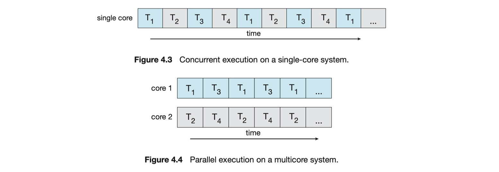
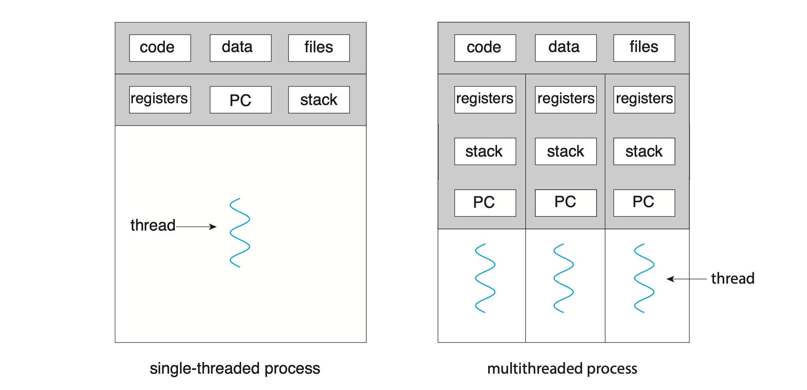
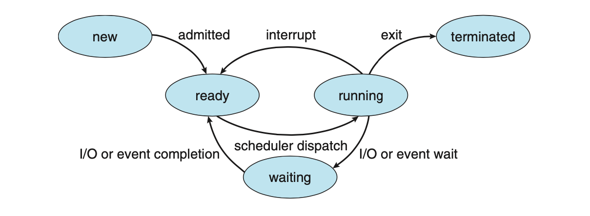
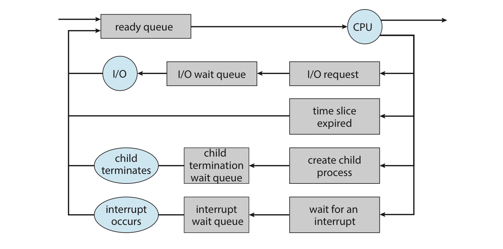

# Operating System (운영체제)

> 작성자 : [권혁진](https://github.com/KimKwon), [서그림](https://github.com/Seogeurim), [윤가영](https://github.com/yoongoing), [장주섭](https://github.com/wntjq68), [정희재](https://github.com/Hee-Jae), [이세명](https://github.com/3people)

<details>
<summary>Table of Contents</summary>

- [프로세스와 스레드](#프로세스와-스레드)
- [멀티 프로세스와 멀티 스레드](#멀티-프로세스와-멀티-스레드)
- [프로세스 스케줄링](#프로세스-스케줄링)
- [CPU 스케줄링](#CPU-스케줄링)
- [동기와 비동기의 차이](#동기와-비동기의-차이)
- [프로세스 동기화](#프로세스-동기화)
- [메모리 관리 전략](#메모리-관리-전략)
- [가상 메모리](#가상-메모리)
- [캐시](#캐시)

</details>

---

## 프로세스와 스레드

- **프로그램** : 파일 단위로 저장 장치에 저장되어 있으며, 아직 실행되지 않은 상태의 코드 덩어리를 의미한다.
- **프로세스** : 실행 중인 프로그램이다. 프로그램을 실행하기 위해서는 주소 공간, 파일, 메모리 등이 필요한데 운영체제로부터 이런 것들을 할당 받은 프로그램을 프로세스라고 부른다.
- **스레드** : 프로세스의 실행 단위이다. 같은 프로세스 내에 있는 스레드끼리는 프로세스의 자원을 공유할 수 있다.

### 프로세스 (Process)

프로세스는 운영체제로부터 메모리 공간을 할당 받아 실행 중인 프로그램이다. 

#### 프로세스에 할당되는 메모리 영역

> 코드(Code), 데이터(Data), 힙(Heap), 스택(stack) 영역

- **코드 영역** : 프로세스가 실행할 코드가 기계어의 형태로 저장된 공간이다. (컴파일 타임에 결정, Read-Only)
- **데이터 영역** : 전역 변수, static 변수 등이 저장된 공간이다. 전역 변수, static 변수를 참조한 코드는 컴파일하고 나면 데이터 영역의 주소값을 가르킨다. (컴파일 타임에 결정, Read-Write : 실행 도중 변경 가능)
- **힙 영역** : 프로그래머가 관리하는 메모리 영역으로, 힙 영역에 메모리를 할당하는 것을 동적 할당이라고 한다. (런타임에 결정, 스택보다 할당할 수 있는 메모리 공간이 많으나 데이터 읽고 쓰기가 느림)
- **스택 영역** : 함수 안에서 선언된 지역변수, 매개변수, 리턴값, 복귀 주소 등이 저장된다. 스택의 LIFO 방식에 따라 함수 호출 시 기록하고 종료되면 제거한다. (컴파일 타임에 결정, 정해진 크기가 있으므로 stack overflow 에러 발생 가능)

#### 프로세스 제어 블록 (Process Control Block, PCB)

PCB는 특정 프로세스에 대한 정보를 담고 있는 운영체제의 자료구조이다. 프로세스는 운영체제의 스케줄링 알고리즘에 따라 CPU를 할당받는다. 작업을 진행하다가 프로세스 전환이 발생하면 하던 일을 저장하고 CPU를 반환해야 한다. 그리고 나중에 스케줄링에 의해 재실행되었을 때 이전에 어디까지 작업이 진행되었는지 그 정보를 알아야 한다. 그 정보가 담긴 공간이 PCB이다. 프로세스 생성과 동시에 그 프로세스의 고유한 PCB도 함께 생성된다.

#### 프로세스 제어 블록(PCB)에 저장되는 정보

- 프로세스 식별자 (Process ID, PID)
- 프로세스 상태 (Process state) : new, ready, running, waiting, terminated
- 프로그램 카운터 (Program counter) : 프로세스가 다음에 실행할 명령어의 주소를 가리킴
- CPU 레지스터 : Accumulator, Index Register, 범용 레지스터 등
- CPU 스케줄링 정보 : 프로세스 우선순위, 최종 실행 시각, CPU 점유 시간 등
- 메모리 관리 정보 : Page table, Segment table 등
- 계정 정보 : CPU 사용 시간, 제한 시간, 계정 번호 등
- 입출력 상태 정보 : 프로세스에 할당된 입출력 장치, 개방된 파일 목록 등

### 스레드 (Thread)

스레드는 프로세스를 구성하는 독립적인 실행 단위이다. 스레드는 같은 프로세스 내 다른 스레드와 메모리 영역을 공유할 수 있다.

- 스레드도 하나의 실행 흐름이므로 실행과 관련된 데이터가 필요하다.
  - 독립적 : 각 스레드는 자신만의 고유한 **스레드 ID, 프로그램 카운터 (PC), 레지스터 집합, 스택 영역**을 가진다.
  - 공유 : 그리고 **속한 프로세스 내의 코드/데이터/힙 영역과 기타 운영체제 자원 (열린 파일, 신호 등)** 을 다른 스레드와 공유한다.
- 각 스레드는 스택 영역을 통해 독립적인 실행 흐름을 가진다.
- 스레드는 프로세스 메모리 영역을 공유하기 때문에 어떤 스레드 하나에서 오류가 발생하면 같은 프로세스 내의 다른 스레드 모두가 강제로 종료된다. (프로세스는 한 프로세스가 강제 종료되어도 공유 자원을 손상시키는 경우가 아니라면 다른 프로세스에게 영향을 주지 않는다.)

## 멀티 프로세스와 멀티 스레드

### 동시성 - Concurrent vs Parallel

- **Concurrent** : 어떤 Job 여러 개가 동시에 처리된다는 개념 (멀티)
- **Parallel** : 어떤 하나의 Job을 쪼개서 여러 sub-job으로 나누고, 이를 물리적으로 분리된 구조에서 동시에 처리해서 완성하는 개념 (자동차 조립을 여러 사람이 동시에 하는 것, CPU의 Core 여러 개 표현)

따라서 parallelism 없이 concurrency를 가지는 것이 가능하다.

멀티 프로세서나 멀티 코어 구조가 발전하기 전에는 싱글 프로세서로 재빠르게 프로세스를 전환하여 concurrent하게 동작하지만 parallel하게 동작하는 것처럼 보이도록 하였다.



### 컨텍스트 스위칭 (Context-Switching)

Context-Switching 이란, **CPU 코어를 다른 프로세스로 전환하기 위해 현재 프로세스의 상태 저장 및 다른 프로세스의 상태 복원을 수행하는 작업**을 말한다.

- Context란 CPU가 프로세스를 실행하기 위한 정보를 말하며, PCB에 저장되는 정보들이 해당된다.
- Context-Switching이 발생하면 커널이 이전 프로세스의 context를 그 프로세스의 PCB에 저장하고 새롭게 실행할 (스케줄링으로 예약) 프로세스의 저장된 context를 불러오게 된다.
- Context-Switching 수행 중에는 CPU의 자원이 어떤 프로세스에 할당된 상태가 아니기 때문에 CPU가 아무 작업도 할 수 없다. (따라서 Context-Switching time은 pure overhead)

### 멀티 프로세스 (Multi-Process)

여러 개의 프로세스를 동시에 수행하는 것이다.

> 프로세스는 부모-자식 관계라고 해도 자신만의 메모리 영역을 가지게 되며, 공유되는 메모리 영역 없이 독립적인 구조를 가진다.

#### 크롬 브라우저의 멀티 프로세스 구조

대부분의 브라우저는 탭 브라우징을 지원한다. 만일 브라우저가 멀티 프로세스 구조를 가지지 않는다면, 어떤 탭의 웹 어플리케이션이 비정상 종료되었을 때 다른 모든 탭을 포함한 전체 프로세스가 종료될 것이다.

구글의 크롬 브라우저는 멀티 프로세스 구조를 가지고 있다. 브라우저의 각 탭은 (Renderer) 프로세스이며, 이들은 각자 독립적으로 실행된다. 하나의 웹 사이트가 비정상 종료되어도 다른 (Renderer) 프로세스는 영향을 받지 않는다.

크롬은 다음과 같은 3가지 유형의 프로세스를 지원한다.

- **브라우저 프로세스** : 사용자 인터페이스와 디스크 및 네트워크 I/O를 관리한다. 크롬이 시작되면 새 브라우저 프로세스가 생성된다.
- **Renderer 프로세스** : 웹 페이지 렌더링을 위한 로직(HTML, JavaScript, 이미지 등 처리)을 포함한다. 이 때, 새 탭에서 열리는 각 웹 사이트에 대해 새 Renderer 프로세스가 생성되므로 여러 프로세스가 동시에 활성화될 수 있다.
- **플러그인 프로세스** : Flash 또는 QuickTime과 같은 각 플러그인 유형에 대해 플러그인 프로세스가 생성된다. 플러그인 프로세스에는 플러그인에 대한 코드와 연관된 Renderer, 브라우저 프로세스와 통신할 수 있도록 하는 추가 코드가 포함되어 있다.

#### 멀티 프로세스의 통신 방법

독립적인 메모리 영역을 가지는 프로세스끼리도 통신하는 방법이 있다. 데이터를 교환하기 위해서 **IPC (Inter-Process Communication)** 메커니즘이 필요하다. IPC에는 **공유 메모리 (shared memory)** 와 **메시지 전달 (message passing)** 의 두가지 모델이 있다.

- 공유 메모리 : 프로세스가 공유하는 메모리 영역이 설정되며, 각 프로세스는 공유 영역에서 데이터를 읽고 쓰는 방식으로 정보를 교환할 수 있다.
- 메시지 전달 : 프로세스 간 메시지를 교환하며 통신한다.

#### 멀티 프로세스의 장점

- 독립된 구조를 가지기 때문에 안전성이 높다.
- 하나의 프로세스가 비정상적으로 종료되어도 자식 프로세스 이외의 다른 프로세스들은 아무런 영향을 받지 않는다.

#### 멀티 프로세스의 단점

- 독립된 메모리 영역을 가지고 있기 때문에 Context Switching을 위한 오버헤드(캐시 초기화 등)가 발생한다.
- Context Switching이 빈번하게 일어나면 성능 저하를 유발할 수 있다.

### 멀티 스레드 (Multi-Thread)

한 프로세스에서 여러 개의 쓰레드를 동시에 수행하는 것이다.



#### 멀티 스레드를 적용한 어플리케이션의 예시 (Multi-threaded applications example)

- 웹 서버 프로세스는 클라이언트 요청이 들어오면 그 요청을 처리하기 위한 별도의 스레드를 생성한다. 이는 새 프로세스를 생성하는 것보다 비용적인 측면에서 훨씬 효율적이다.
- 운영체제의 커널은 멀티 스레드이다. Linux 시스템 부팅 시 여러 커널 스레드가 생성되고, 각 스레드는 장치 관리, 메모리 관리 또는 인터럽트 처리와 같은 특정 작업을 수행한다. (`ps -ef` 명령을 사용하여 실행 중인 Linux 시스템에서 커널 스레드를 표시 할 수 있다.)
- 이미지의 모음에서 사진 썸네일을 생성하는 어플리케이션은 별도의 스레드를 사용하여 각각의 개별 이미지에서 썸네일을 생성할 수 있다.
- 웹 브라우저는 하나의 스레드에서는 이미지나 텍스트를 보여주고, 또다른 스레드에서는 네트워크를 통해 데이터를 검색할 수 있다.
- 워드 프로세서는 그래픽을 표시하기 위한 스레드, 사용자의 키 입력에 응답하기 위한 스레드, 백그라운드에서 맞춤법 및 문법 검사를 수행하기 위한 스레드를 가질 수 있다.

#### 멀티 스레드의 장점

- **응답성**이 좋아진다. 단일 스레드를 사용하면 그 작업이 완료될 때까지 응답을 기다려야 한다. 멀티 스레드를 사용함으로서 응답성을 향상시킬 수 있다.
- **자원을 공유**할 수 있다. 프로세스는 공유 메모리 및 메시지 전달과 같은 기술을 통해서만 자원을 공유할 수 있다. 하지만 스레드는 기본적으로 자신이 속한 프로세스의 자원을 공유하기 때문에 동일한 주소 공간 내에서 여러 스레드를 가질 수 있다.
- **비용**이 적다. 스레드는 자신이 속한 프로세스의 자원을 공유하므로 스레드 생성과 Context-Switching 비용이 더 적다.

#### 멀티 스레드의 단점

- 스레드는 프로세스 내 자원을 공유하기 때문에 스레드 하나에서 오류가 발생하면 같은 프로세스 내의 모든 스레드가 종료될 수 있다.
- 공유 자원에 대한 동기화 문제를 고려해야 한다.

## 프로세스 스케줄링

프로세스 스케줄러는 **멀티 프로그래밍**과 **time sharing**의 목적을 달성하기 위해 실행 가능한 여러 프로세스 중에서 하나의 프로세스를 선택해 실행한다. 각 CPU 코어는 한번에 한 프로세스를 실행할 수 있다. 따라서 단일 CPU 코어 시스템에 반해 멀티 코어 시스템은 한 번에 여러 프로세스를 실행할 수 있다.

- 멀티 프로그래밍 (multiprogramming) : CPU 사용률을 최대화하기 위해 항상 프로세스를 실행하도록 한다. 어떤 프로세스가 CPU를 사용하다가 I/O 작업 등 CPU를 필요로 하지 않는 순간이 오면 다른 프로세스가 CPU를 사용할 수 있도록 한다.
- 시분할 (time sharing) : 각 프로그램이 실행되는 동안 사용자들이 상호작용할 수 있도록 프로세스 간 CPU 코어를 자주 전환하는 것이다. CPU가 하나의 프로그램을 수행하는 시간을 매우 짧은 시간(ms)으로 제한하여 프로그램을 번갈아 수행하도록 하면 CPU가 하나인 환경에서도 여러 사용자가 동시에 사용하는 듯한 효과를 가져올 수 있다.

### 프로세스 상태



- **New** : 프로세스가 생성됨
- **Running** : 프로세스의 Instruction이 실행됨
- **Waiting** : (I/O 작업 완료나 신호 수신과 같은) 이벤트가 발생하기를 기다림
- **Ready** : 프로세서에 할당되기를 기다림
- **Terminated** : 프로세스가 실행을 끝냄

### 스케줄링 큐

#### Ready Queue

- 프로세스가 시스템에 들어오면 ready queue에 들어가서 CPU 코어에서 실행되기를 기다린다.
- Linked List 형태로 저장되며, ready queue의 header는 list의 첫번째 PCB를 가리키고, 각 PCB의 포인터는 ready queue에 있는 다음 PCB를 가리킨다.

#### Wait Queue

- I/O 요청과 같은 특정 이벤트가 처리 완료되기까지를 기다리는 프로세스가 wait queue에 배치된다.
- 프로세스는 waiting 상태에서 ready 상태로 바뀌면 ready queue에 들어가게 된다.



프로세스는 종료될 때까지 위의 Queueing-diagram과 같은 주기를 반복하고, 종료되면 모든 큐에서 제거되고 PCB 및 자원 할당이 해제된다.

> 내용 추가 예정

## CPU 스케줄링

CPU 스케줄링은 Ready Queue에 있는 프로세스들을 대상으로 이루어진다.

### 선점 / 비선점 스케줄링 (Preemptive and Non-preemptive Scheduling)

CPU 스케줄링은 다음의 4가지 상황에 대하여 발생할 수 있다.

1. 프로세스가 running → waiting 상태로 전환 (ex. I/O 요청 또는 하위 프로세스 종료를 위한 wait() 호출)
2. 프로세스가 running → ready 상태로 전환 (ex. interrupt 발생)
3. 프로세스가 waiting → ready 상태로 전환 (ex. I/O 완료)
4. 프로세스 종료

스케줄링 시 상황 1, 4에서는 선택권 없이 새 프로세스를 선택해야 한다. 하지만 상황 2, 3에서는 다음과 같은 선택권이 있다.

- **비선점 스케줄링** : CPU가 할당된 어떤 프로세스는 종료 / waiting 상태로 전환하여 CPU를 해제할 때까지 CPU를 유지하고, 다른 프로세스는 그 때까지 CPU를 사용할 수 없다.
- **선점 스케줄링** : 어떤 프로세스가 CPU를 점유하고 있을 때 다른 프로세스가 CPU를 선점할 수 있다. Windows, macOS, Linux 및 UNIX를 포함한 거의 모든 최신 운영체제는 선점 스케줄링 알고리즘을 사용한다.

### 스케줄링 알고리즘

#### FCFS (First-Come, First-Served) Scheduling

- **비선점 스케줄링**
- 먼저 CPU를 요청하는 프로세스에 먼저 CPU가 할당된다.
- FIFO queue 를 사용해 쉽게 구현할 수 있다.
- 문제점) **convoy effect** : 먼저 들어온 어떤 프로세스의 CPU 처리 시간이 길 경우 다른 모든 프로세스들이 기다림으로서 더 짧은 프로세스가 먼저 진행될 수 있는 경우보다 CPU 및 장치 사용률이 낮아지는 현상

#### SJF (Shortest-Job-First) Scheduling

- **비선점 스케줄링 방식** : CPU burst time이 가장 작은 프로세스에게 먼저 CPU를 할당한다. 만일 CPU burst time이 같다면, FCFS 방식을 적용한다.
- **선점 스케줄링 방식 (SRTF (Shortest-Remaining-Time-First) Scheduling)** : 새로 들어온 프로세스의 CPU burst time이 현재 실행 중인 프로세스의 남은 burst time 보다 작다면 현재 실행 중인 프로세스를 새로 들어온 프로세스가 선점한다.
- [Priority Scheduling](#priority-scheduling)의 한 예이다. (우선순위 = CPU burst time)
- 주어진 프로세스 집합에 대해 **최소 평균 대기 시간**을 제공한다는 점에서 최적의 알고리즘이다. 하지만 CPU burst time을 알 수 있는 방법이 없기 때문에 CPU 스케줄링 수준에서 구현할 수 없다. 이에 대한 한 가지 접근 방식은 SJF 스케줄링을 근사화하는 것이며, 이전 CPU burst time 지수 평균으로 예측할 수 있다.
- 문제점) **starvation** : CPU 처리 시간이 긴 프로세스는 계속 Ready Queue의 뒤로 밀려나기 때문에 무한정 기다리는 상황이 발생할 수 있다.

#### RR (Round-Robin) Scheduling

- **선점 스케줄링**
- 각 프로세스는 **time quantum (or time slice)** 이라는 작은 시간 단위(10-100ms)를 갖게 된다. 프로세스는 1 time quantum 동안 스케줄러에 의해 CPU를 할당 받고, 시간이 끝나면 interrupt를 받아 Ready Queue의 tail에 배치된다.
- Ready Queue는 Circular FIFO queue 형태이다.
- RR의 평균 대기 시간은 긴 편이다. 하지만 공정하다. `n`개의 프로세스가 있고 time quantum이 `q`일 때, 어떤 프로세스도 `(n-1) x q` 시간 단위 이상 기다리지 않는다.

Time quantum 설정 시 주의할 점

- Time quantum이 너무 크다면 : FCFS와 같아진다.
- Time quantum이 너무 작다면 : Context Switching이 너무 빈번하게 일어나 overhead가 발생한다.

위와 같이 RR 알고리즘의 성능은 time quantum의 크기에 좌우될 수 있으므로 적절히 선정해야 하며 이는 context-switch time보다 큰 것이 좋지만 또 너무 커서는 안 된다. (경험적으로 CPU burst의 80프로는 time quantum보다 짧은게 좋다고 함)

#### Priority Scheduling

- 정수로 표현된 우선순위가 더 높은 프로세스에게 CPU를 할당하는 스케줄링이다. 우선순위는 내부적/외부적으로 정의할 수 있다.
  - 내부적 : 시간 제한, 메모리 요구 사항, 열린 파일 수, 평균 I/O burst 대 평균 CPU burst 비율 등 측정 가능한 수량 사용해 계산
  - 외부적 : 프로세스의 중요성, 컴퓨터 사용에 대해 지불되는 자금의 유형 및 금액, 작업을 후원하는 부서, 기타 정치적 요인 등
- **선점 / 비선점 스케줄링** 모두 가능하다.
  - 선점 방식 : 새로 도착한 프로세스의 우선 순위가 현재 실행 중인 프로세스의 우선 순위보다 높으면 CPU 선점
  - 비선점 방식 : 같은 경우 단순히 새 프로세스를 Ready Queue의 맨 앞에 둔다.
- 문제점) **indefinite blocking**, **starvation**
  - 실행할 준비가 되었으나 CPU를 기다리는 프로세스는 block된 것으로 간주될 수 있다.
  - 우선 순위가 낮은 일부 프로세스는 무기한 대기 상태가 될 수 있다.
- 해결 방안) **Aging**, **Round-Robin과 결합**
  - Aging : 오랫동안 대기하는 프로세스의 우선순위를 점진적으로 높이는 방식으로 문제점을 해결할 수 있다. 예를 들어 대기 중인 프로세스의 우선순위를 매초 늘리는 것이다. 
  - RR+PS : 우선순위가 가장 높은 프로세스를 실행하는데, 동일한 우선순위의 프로세스에 대해서는 Round-Robin 스케줄링을 적용한다.

---

## 동기와 비동기의 차이

**Synchronous == Blocking ? Asynchronous == Non-blocking?**

결론 부터 말하자면 다르다.

동기와 비동기, Blocking 과 Non-blocking은 각각 관심을 갖는 부분이 다르다.

Sync & Async

> 동기와 비동기는 호출 되는 함수의 완료를 호출한 쪽에서 신경을 쓰냐 호출 받은 쪽에서 신경을 쓰냐의 차이다.

Blocking & Non-blocking

> Blocking 호출받은 쪽이 호출한 쪽에 제어권을 넘겨주지 않는 것이고 Non-blocking은 다시 제어권을 넘겨 주는 것이다.

네가지 조합

|     Sync & Blocking     |     Async & Blocking     |
| :---------------------: | :----------------------: |
| **Sync & Non-blocking** | **Async & Non-blocking** |

이 모든 경우의 수가 가능하다.

- Sync & Blocking

  가장 기본적으로 생각하는 Sync 이다. 함수를 호출하면 호출 받은 쪽에서 제어권을 가지고 있기 때문에 결과값이 반환 될때 까지 다음 동작을 시행 하지 않는다.

- Sync & Non-Blocking

  Non-Blocking 이라 함수가 완료 되지 않아도 제어권은 넘겨 주어 함수를 호출한 쪽에서 다음 동작을 시행 할 수는 있지만 함수가 완료되는 것을 신경을 써야하기 때문에 주기적으로 함수가 완료 되었는지 확인 해야한다.

- Async & Blocking

  잘 상상이 안 가는 그림이다. 작업완료 여부를 호출된 쪽에서 신경 쓰고 제어권도 호출된 쪽에서 가지고 있다. 사실상 Sync & Blocking과 거의 같아 잘 사용되지 않는다.

- Async & Non-blocking

  가장 기본적으로 생각하는 Async이다. 함수를 호출하면 제어권을 다시 호출 한쪽으로 넘겨주어 다음 동작을 이어 나가면서 호출 받은 쪽에서 알아서 콜백 함수의 결과를 리턴하여준다.

---

## 프로세스 동기화

### Critical Section(임계구역) 이란?

- 동일한 자원을 동시에 접근하는 작업을 실행하는 코드영역
- 멀티 쓰레딩의 문제점이 발생

Example

> ```c
> Counter++;
> =>
> LOAD register1 = counter
> INCREASE register1 = register1 +1
> STORE counter = register1
> Counter--;
> =>
> LOAD register2 = counter
> DECREASE register2 = counter -1
> STORE counter = register2
> ```
>
> 만약, counter = 5 라고 가정하고 counter++ 과 counter-- 를 서로다른 쓰레드에서 실행 시키면 실행 순서에 따라 4, 5 ,6 모두 결과 값으로 나올 수 있다.

### Ctritical Section Problem

공통된 (data) 영역에 하나의 프로세스(task or thread) 만 들어 갈 수 있도록 설계하는 것. 이러한 설계를 위해서는 세가지 요구조건이 충족 되어야 한다.

1. Mutual Exclusion(상호배타)

> 어떠한 Task(Thread)가 Critical Section 을 사용중이면 다른 Task는 사용이 불가함.

2. Progress

> 현재 Critical Section 을 사용중인 Task가 없고 Critical Section에 들어가길 원하는 Task 가 있다면 바로 들여보냄

3. Bounded Waiting

> 한정된 대기시간을 가져야 한다 => 무한 대기 X

#### Hardware Solution

1. Memory Barriers
2. Compare & Swap
3. Atomic Variables.

#### Software Solution

1. Mutex Lock (hardware-based)

> - Acquire() : Lock 획득
> - Release() : Lock 방출
>
> Task가 Crtical Section에 들어갈 때 acquire() 하고 나올 때 release() 하여 한 Task만 Critical Section 에 들어 갈 수 있게 한다.
>
> => 화장실 칸 한개 열쇠 한개!
>
> ```c
> while(true){
>   acquire();
>   /* Critical Section*/
>   release();
>   /* Remainder Section*/
> }
>
> acquire(){ // 사용가능 해지면 크리티컬 섹션에 들어간후 문을 잠금!
>   while(!available) // Busy Waiting
>     available = false;
> }
> release(){ // 사용가능 하게 해줌
>   available = true;
> }
> ```
>
> 문제점 : Busy waiting(spin lock) 으로 인해 효율이 떨어진다.

2. Semaphores

> Wait 과 Signal을 이용하여 control 한다.
>
> Semaphore는 Critical Section에 들어갈 수 있는 task의 수이다. 자원의 갯수가 여러개라고 생각하는 것이 편하다. 따라서 Critical Section에 상호 배타적으로 들어 갈 수 있는 것이다.
>
> => 화장실(Critical Section)안에 칸(자원) n개 , 전광판에 n 표시
>
> Semaphore = 1 이면 Mutex Lock 과 같은 방식으로 움직인다.
>
> ```c
> Semaphore s // Integer Value & Positive #
> ```
>
> - Busy Waiting 을 사용하는 Semaphore
>
> ```c
> wait(s){
>   while(s <= 0){} // busy waiting
>   s--
> }
> signal(s){
>   s++
> }
> ```
>
> s 값이 양수여야지만 Critical Section에 들어가 작업을 수행 할 수 있음.
>
> Busy waiting을 사용하는 구현은 Critical Section 은 있지만 사용하고자 하는 Task의 수가 적을 때 사용함.
>
> - Busy Waiting 을 사용하지 않는 Semaphore
>
> ```c
> // waiting queue를 사용
> wait(s){
>   s--;
>   if(s < 0){ // s < 0 이면 s의 절댓값 만큼 waiting queue에서 Task 대기중
>     // waiting queue에 task t 를 집어넣음
>     block();
>   }
> }
> signal(s){
>   s++;
>   if(s <= 0){ // waiting queue에서 대기중인 task 존재
>     // waiting queue에서 task t 를 제거
>     wakeup(t);
>   }
> }
> ```

**Mutex Lock 과 Semaphore 의 차이!**

- Semaphore 는 Mutex Lock이 될 수 있지만 역은 성립하지 않는다.
- Semaphore 는 프로세스 범위에서 소유 불가능 , Mutex는 소유 가능

- Mutex Lock은 Lock을 갖고 있는 thread가 해제 가능한 반면, Semaphore는 외부에서도 해제 가능
- Semaphore 는 시스템 범위에 걸쳐져 있고 파일형태로 존재하는 반면, Mutex Lock은 프로세스 범위 내에 잇어서 종료시 자동으로 clean up 되어짐

3. Monitor

> 가장 발전된 기술, 이런게 있다는 것만 알고 있어도 되긴 하지만 궁금하다면,
>
> Operating System Concepts 10th Edition(공룡책) 6장 내용을 참고하길 바람.

---

## 메모리 관리 전략

아래의 자료에서 자세한 설명과 코드를 볼 수 있다.

- 작성자 이세명 | [Paging, Segmentation](./materials/이세명_operating-system_memory-management.pdf)

---

## 가상 메모리

---

## 캐시

### 캐시란?

캐시란, 자주 사용하는 데이터나 값을 미리 복사해 놓는 임시 장소를 가리킨다. 캐시는 저장 공간이 작고 비용이 바싼대신, 데이터를 미리 복사해 놓기 때문에 계산이나 접근 시간 없이 더 빠른 속도로 데이터에 접근할 수 있다.

#### 캐시는 아래의 데이터의 경우에 사용하면 좋다.

1. 업데이트가 자주 발생하지 않는 데이터
2. 반복적으로 동일한 결과를 돌려주는 경우
3. 자주 조회되는 데이터

- 결국 캐시는 지속적으로 DBMS 혹은 서버에 요청하는것이 아닌, 메모리에 데이터를 저장하였다가 불러다 쓰는 것을 의미한다.

### 지역성

CPU에서 명령어를 수행하며 매번 캐시 메모리를 참조하게 되는데, 이때 Hit률이 지역성을 갖는다.
지역성이란, 프로세스들이 기억장치 내의 정보를 균일하게 액세스하는 것이 아니라, 어느 순간에 특정부분을 집중적으로 참조하는것을 말한다. 지역성은 메모리의 위치와 접근 시간에 따라서 공간적, 시간적인 특성을 보인다.

#### 공간적 지역성

한 번 참조한 메모리의 옆에 있는 메모리를 다시 함조하게 되는 성질을 말한다.
- Array라는 일정한 메모리 공간을 순차적으로 할당받아 사용할 때, 공간 할당을 연속적으로 받게 된다. 이 Array 메모리가 사용되어질때 연속적으로 사용될 가능성이 높아진다.

#### 시간적 지역성

한 번 참조된 주소의 내용은 곧 다음에 다시 참조된다는 특성을 말한다.
- 반복문 사용 시, 특정 메모리값으로 선언된 부분을 반복하여 접근하게 된다.

### Local Cache vs Global Cache

또한 캐시는 하드웨어가 아닌, 서버의 기준으로 로컬 캐시와 글로벌 캐시로 나뉜다.
로컬 캐시와 글로벌 캐시를 알맞게 선택하여 사용할 경우, 시스템의 성능을 높일 수 있다.

#### Local Cache

1. 서버마다 캐시를 따로 저장한다.
2. 다른 서버의 캐시를 참조하기 어렵다.
3. 서버 내에서 작동하기 때문에 속도가 빠르다.
4. 로컬 서버 장비의 리소스를 이용한다.(리소스 : 메모리, 디스크)

#### Global Cache

1. 여러 서버에서 캐시 서버에 접근하여 참조 할 수 있다.
2. 별도의 캐시 서버를 이용하기 때문에 서버 간 데이터 공유가 쉽다.
3. 네트워크 트래픽을 사용해야 해서 Local Cache보다 느리다.
4. 데이터를 분산하여 저장할 수 있다.

### Reference
- 작성자 권혁진 | [[CS] 캐시 메모리](https://nukw0n-dev.tistory.com/9)
- https://j0free.tistory.com/3
- 2021 시나공 정보처리기사 필기

---

## 교착상태

아래의 자료에서 자세한 설명과 코드를 볼 수 있다.

- 작성자 권혁진 | [[CS] 캐시 메모리](https://nukw0n-dev.tistory.com/9)

---

## 질의응답

_질문에 대한 답을 말해보며 공부한 내용을 점검할 수 있으며, 클릭하면 답변 내용을 확인할 수 있습니다._

<details>
<summary>프로그램과 프로세스의 차이에 대하여 설명해보세요.</summary>
<p>
  
- **프로그램**: 작업을 위해 실행할 수 있는 파일의 단위를 의미함.
- **프로세스**: 메모리에 적재되어 `CPU`를 할당받아 실행 중인 프로그램을 프로세스라 일컬음.

</p>
</details>

<details>
<summary>프로세스와 스레드의 차이에 대하여 설명해보세요.</summary>
<p>

- 스레드는 프로세스를 구성하는 실행 단위입니다.
- 프로세스와 달리 스레드는 코드, 데이터, 힙 영역을 통해 프로세스 자원을 공유할 수 있습니다.
- 프로세스와 달리 스레드는 자원을 공유하기 때문에 한 스레드에서 오류가 발생하면 같은 프로세스 내의 스레드 모두가 종료됩니다.

</p>
</details>

<details>
<summary>프로세스가 도중에 중지되는 경우, 그 원인과 다시 실행할 수 있는 방법은 무엇일까요?</summary>
<p>
  
- 원인 : `인터럽트` 혹은 `시스템 콜` 등에 의해 프로세스가 중지될 수 있다.
- 다시 실행할 수 있는 방법 : PCB 안에 해당 프로세스의 정보(프로그램카운터와 같은 실행 정보 등)가 저장되어 있기 때문에 추후에 실행 가능한 상태가 되면 PCB를 통해 다시 실행할 수 있다.

</p>
</details>

<details>
<summary>프로세스의 힙, 스택 영역에는 어떤 정보가 있나요?</summary>
<p>
  
- **힙 영역**: 동적 할당되는 모든 요소들
- **스택 영역**: 매개변수, 로컬변수, 리턴값, 복귀주소 등

</p>
</details>

<details>
<summary>스택을 스레드마다 독립적으로 할당하는 이유가 무엇인가요?</summary>
<p>  

각 스레드가 독립적인 실행 흐름을 갖기 위해서는 `독립적인 함수 호출이 보장`되어야 하기 때문입니다.

</p>
</details>


<details>
<summary>스레드와 멀티 스레드의 차이에 대하여 설명하고, 멀티 스레드의 장단점을 설명해보세요.</summary>
<p>

- **스레드** : 할당 받은 자원을 이용한 프로세스의 실행 흐름의 단위이다.
- **멀티 스레드** : 한 프로세스 내에서 이러한 스레드가 여러 개 동작하는 방식을 의미한다.
</p>
<p>

- 멀티스레드의 장점 : 프로세스를 여러개 두는 방식에 비해 컨텍스트 스위칭 비용이 적게 들며 응답 시간이 빠르다는 장점이 있다.
- 멀티스레드의 단점 : 같은 프로세스 내의 자원을 다른 스레드들과 공유하므로 `동기화 문제`를 고려해야 한다. 또한 프로세스가 종료되면 내부 스레드들 역시 모두 종료되므로 한 스레드가 프로세스를 의도치 않게 종료했을 경우 나머지 스레드들도 모두 종료될 수 있다는 단점이 있다.
</p>
</details>

<details>
<summary>멀티 스레드와 멀티 프로세스의 차이를 말해주세요.</summary>
<p>  

- **멀티 스레드** : 적은 메모리 공간 차지, context switch 빠름. 하지만 동기화 문제가 있고 하나의 스레드가 종료되면 전체 스레드가 종료될 수 있음.
- **멀티 프로세스** : 하나의 프로세스가 죽더라도 다른 프로세스에는 영향을 끼치지 않음. 하지만 많은 메모리 공간을 차지하고 CPU 점유 시간을 많이 차지함.

</p>
</details>

<details>
<summary>Context Switching에 대하여 설명해보세요.</summary>
<p>
  
프로세스는 CPU를 할당받은 상태의 실행 중인 프로그램이다. 현재 CPU를 할당받아 실행중인 프로세스 A와 대기중인 프로세스 B가 있다고 가정했을 때, A 프로세스에서 B 프로세스로 CPU 사용/제어권이 이전되는 것을 `Context Switching` 이라고한다.

</p>
</details>

---

<details>
<summary>스케쥴링이 왜 필요한가요?</summary>
<p>
  
한정적인 메모리(자원)를 효율적으로 관리하기 위해, 공정성을 주기 위해 필요하다.
</p>
</details>

<details>
<summary>스케줄러와 CPU 스케줄러의 차이에 대하여 설명해보세요.</summary>
<p>
  
스케줄러(=Job Scehduler, 장기 스케줄러)는 디스크와 메모리 간 스케줄링을 담당한다.
  
CPU 스케쥴러(= 단기 스케줄러)는 메모리와 CPU 간 스케줄링을 담당한다.
</p>
</details>

<details>
<summary>중기 스케쥴러에서 suspended 상태와 blocked 상태의 다른점은 무엇인가요?</summary>
<p>
  
blocked 상태는 다른 I/O 작업을 기다리는 상태이기 때문에 스스로 ready queue로 돌아갈수 있지만, suspended는 외부적인 이유로 유예됐기 때문에 스스로 돌아갈 수 없다.
</p>
</details>

<details>
<summary>FCFS 스케줄링을 개선한 스케줄링 방식에 대하여 설명해보세요.</summary>
<p>
  
FCFS는 먼저 도착한 프로세스에게 CPU를 할당하는 기법이다. 
  
하지만 먼저 도착한 프로세스가 실행 시간이 긴 경우 나중에 도착한 프로세스들의 대기 시간이 길어지는 ```Convoy Effect``` 라는 문제점을 가지고 있다.

이를 개선한 `SJF(Shortest Job First)` 기법이 있다.

SJF는 짧은 실행시간을 갖는 프로세스에게 CPU를 먼저 할당하는 기법이다. 

Convoy Effect는 해결하였지만, 실행시간이 긴 프로세스는 계속 CPU를 할당받지 못하는 `Starvation 현상`이 일어날 수 있다.
</p>
</details>

<details>
<summary>Round Robin 스케줄링 방식에서 time quantum 설정에 따른 결과를 설명해보세요.</summary>
<p>

RR 기법에서 

 - 타임퀀텀이 긴 경우: 타임퀀텀이 프로세스의 실행시간과 비슷해진다면 FCFS랑 다를 바 없어진다.
  
 - 타임퀀텀이 짧은 경우: 타임퀀텀이 짧아 Context Switching이 자주 일어나게 되어 오버헤드가 발생한다.
</p>
</details>

<details>
<summary>오버헤드가 어떤건가요?</summary>
<p>

프로그램의 실행 흐름 도중에 동떨어진 위치의 코드를 실행시켜야 할 때, 추가적으로 시간, 메모리, 자원이 사용되는 현상을 오버헤드라 한다.

</p>
</details>

---

<details>
<summary>Synchronous 와 Asynchronous의 차이점이 무엇인가요.</summary>
<p>

호출되는 함수에 대해 작업 완료 여부를 호출한 쪽에서 확인하면 Synchronous, 반대로 호출 받은 쪽에서 확인을 하면 Asynchronous 라고 한다.

</p>
</details>

<details>
<summary>Blocking 과 Non-Blocking의 차이점이 무엇인가요.</summary>
<p>

호출 받은 쪽에서 함수값을 바로 리턴하지 않고 제어권을 들고 있으면 Blocking, 바로 리턴을 해주어 다른 일을 할 수 있으면 Non-blocking 이다.

</p>
</details>

---

<details>
<summary>Race Condition(경쟁 상태)에 대하여 간단한 예시를 들어 설명해주세요.</summary>
<p>

Race Condition이란 두 개 이상의 concurrent한 프로세스 혹은 스레드가 공유 자원에 접근하려고 할 때 동기화 메커니즘 없이 접근하여 그 순서에 따라 결과가 달라지는 문제를 말합니다. 간단한 예시로는 계좌 잔고 관리를 설명해보겠습니다. 계좌의 잔고라는 공유 자원 데이터를 확인하고 출금하는 연산을 수행할 때, 동기화가 이루어지지 않으면 잔고에서 이중으로 출금되는 오류가 발생할 수 있습니다.

</p>
</details>

<details>
<summary>여러 프로세스가 데이터를 공유하며 수행될 때, 각 프로세스에서 공유 데이터를 접근하는 프로그램 코드를 무엇이라 부르나요? 그리고 그에 대한 간단한 설명 부탁드립니다.</summary>
<p>

임계 영역입니다. 임계 영역은 공유 자원을 동시에 접근하는 작업을 실행하는 코드 영역을 칭합니다. 공유 자원을 여러 프로세스가 동시에 접근할 때 잘못된 결과를 만들 수 있기 때문에 한 프로세스가 임계 구역을 수행할 때는 다른 프로세스가 접근하지 못하도록 해야 합니다.

</p>
</details>

<details>
<summary>임계 영역을 프로세스들이 같이 쓸 수 있는 전제 조건을 설명해주세요.</summary>
<p>

임계 영역을 프로세스들이 같이 쓸 수 있는 전제 조건으로는 Mutual Exclusion, Progress, Bounded Waiting 3가지가 있습니다.

- 상호 배제 (Mutual Exclusion) : 어떤 task가 임계 영역을 사용 중이면 다른 task는 사용이 불가능합니다.
- 진행 (Progress) : 현재 임계 영역을 사용 중인 task가 없고, 들어가길 원하는 task가 있다면 바로 들여보냅니다.
- 한정된 대기 (Bounded Waiting) : 프로세스가 진입 가능한 횟수에는 제한이 있어서 특정한 한 프로세스만 계속 진입하는 것을 방지합니다.

</p>
</details>

<details>
<summary>Thread-safe에 대하여 설명해주세요.</summary>
<p>

멀티 스레드 환경에서 여러 스레드가 동시에 공유 자원에 접근할 때, 의도한대로 동작하는 것을 말합니다. Thread-safe하기 위해서는 공유 자원에 접근하는 임계 영역을 Mutex, Semaphore 등의 동기화 기법으로 제어해줘야 합니다.

</p>
</details>

<details>
<summary>Reentrant의 개념에 대하여 설명하고, Thread-safe 와의 차이점을 설명해주세요.</summary>
<p>

Reentrant는 재진입성이라는 의미로, Reentrant 함수는 여러 스레드가 동시에 접근해도 언제나 같은 실행 결과를 반환합니다. 이를 만족하기 위해서 함수 내에서는 공유 자원을 사용하지 않고, 호출 시 제공된 매개변수 만으로 동작하면 됩니다. 따라서 Reentrant하다면 Thread-safe하지만 그 역은 성립하지 않습니다.

</p>
</details>

<details>
<summary>Mutex Lock 과 Semaphore 의 차이점이 무엇인가요.</summary>
<p>

- Semaphore는 Mutex Lock이 될 수 있지만 역은 성립하지 않는다.
- Semaphore는 프로세스 범위에서 소유 불가능하고 Mutex는 소유 가능하다.
- Mutex Lock은 Lock을 갖고 있는 thread가 해제 가능한 반면, Semaphore는 외부에서도 해제 가능하다.
- Semaphore는 시스템 범위에 걸쳐져 있고 파일 형태로 존재하는 반면, Mutex Lock은 프로세스 범위 내에 있어서 종료 시 자동으로 clean up 된다.

</p>
</details>

---

<details>
<summary>메모리 구조의 순서가 어떻게 되는지 CPU에서 가까운 순으로 말해보세요.</summary>
<p>

레지스터 → 캐시 메모리 → 메인 메모리 → 보조기억장치 → 외부기억장치의 구조를 가집니다. 
CPU로부터 멀어질수록 사이즈는 커지고, 가격은 저렴해지며, 접근 속도는 느려집니다.

</p>
</details>

<details>
<summary>메모리 관리란 무엇일까요? 왜 할까요?</summary>
<p>

시스템이 실행될 때 여러 프로세스가 실행이 되는데, 각 프로세스가 실행되기 위해서는 메모리를 필요로 한다. 그러나 메모리는 한정되어 있다. 실행되어야 하는 모든 프로세스가 필요한 시기에 적절하게 메모리의 할당을 받을 수 있도록 메모리 관리가 필요하다.

</p>
</details>

<details>
<summary>RAM을 늘리면 어떻게 되나요?</summary>
<p>

RAM을 늘린다는 것은 메인 메모리의 공간을 늘린다는 것이다. 그만큼 한 번에 메모리에 적재시킨 후 처리할 수 있는 프로세스의 양이 많아진다. 따라서 컴퓨터의 속도가 빨라진다.

</p>
</details>

<details>
<summary>컴퓨터의 속도를 빠르게 하고 싶으면 무작정 RAM만 늘리면 되는 것인가?</summary>
<p>

그렇지 않다. 메모리가 늘어나는 만큼 많은 메모리를 감당할 수 있는 하드웨어가 필요하다.
</p>
</details>

<details>
<summary>만약 16GB의 메인메모리를 가지고 있고, 운영체제의 용량이 16GB라고 해보자. 그럼 이 컴퓨터는 운영체제 외에 다른 프로그램은 실행할 수 없는 것인가?</summary>
<p>

운영체제의 용량이 16GB라고해서 16GB 전체를 메모리에 적재하지 않는다. 지금 당장 필요한 부분만 메모리에 적재후 실행한다. 프로그램의 용량이 16GB라고해서 꼭 그 용량만큼의 공간이 필요한 것은 아니다.
</p>
</details>

<details>
<summary>외부 단편화, 내부 단편화에 대하여 설명해보세요.</summary>
<p>

- 외부 단편화 : 전체 메모리의 공간은 충분한 공간을 가지지만 그것들이 연속적이지 않고 작은 공간들로 분산되어 있는 상태를 말합니다.
- 내부 단편화 : 프로세스에 할당된 메모리의 크기가 실제로 사용할 영역보다 커서 남은 공간이 생긴 상태를 말합니다.

</p>
</details>

<details>
<summary>외부 단편화를 해결하기 위한 전략이 있다면?</summary>
<p>

메모리를 한 군데로 몰아넣어 비어있는 hole을 제거하는 '압축' 기술이 있다.
</p>
</details>

<details>
<summary>외부 단편화가 발생할 때마다 압축을 시행해주면 되는 것인가?</summary>
<p>

압축이 외부 단편화를 해결하는 좋은 방법이긴 하지만 압축을 하는데 시간이 오래걸린다. 압축을 자주하는 것은 오히려 성능 저하의 원인이 된다.
</p>
</details>

<details>
<summary>그렇다면 압축 외에 외부 단편화를 해결하는 방안은?</summary>
<p>

Paging. 메모리를 일정한 크기로 분배한 후 프로세스가 요구하는 용량만큼 메모리 조각을 할당한다.
</p>
</details>

---

<details>
<summary>가상메모리를 우리가 왜 사용해야 할까요?</summary>
<p>

프로세스에 존재하는 메모리가 무한하지 않기 때문에 가상메모리를 사용하여야 한다. 메모리가 부족하여 일어나는 예기치 않은 오류들을 가상메모리를 사용함으로써 일어나지 않고 정상적으로 프로세스가 진행할 수 있도록 도와준다.

</p>
</details>

<details>
<summary>가상메모리를 효율적으로 관리하는 방법에는 어떤 것들이 있을까요?</summary>
<p>

대표적으로 두가지 Paging : 고정된 영역인 페이지로 분할 , Segmentation : 가변적인 영역인 세그먼트로 분할이 있다.

</p>
</details>

<details>
<summary>메모리에 적재된 페이지 중 사용하려는 페이지가 없는 현상을 무엇이라고 칭할까요?</summary>
<p>

Page fault

</p>
</details>

<details>
<summary>page fault가 일어났다고 가정해봅시다. 운영체제는 page fault에 대한 해결방법으로 어떻게 행동할까요?</summary>
<p>

보조저장장치에서 해당하는 프로세스를 불러오거나 페이지 교체를 진행합니다.

</p>
</details>

<details>
<summary>페이지를 교체하는 다양한 방법들에 대해 알려주세요.</summary>
<p>

- FIFO : 먼저 메모리에 들어온 페이지 순서대로 교체한다.
- OPR : 앞으로 가장 오랫동안 사용되지 않을 페이지를 찾아 교체한다.
- LRU : 가장 오랫동안 사용되지 않은 페이지를 선택하여 교체한다.
- LFU : 참조 횟수가 가장 적은 페이지를 교체한다.
- MFU : 참조 회수가 가장 많은 페이지를 교체한다.

</p>
</details>

<details>
<summary>페이지들을 할당하려고 하는데 프레임이 매우 커서 편하게 페이지가 할당될 수 있는 상황을 가정해봅시다. 이 상황이 무조건적으로 이득일까요? 만약 아니라면 어떤 상황에서 이득이 아닐지 의견을 듣고 싶어요.</summary>
<p>

벨라디의 모순 현상이 일어날 수 있습니다. 페이지 프레임 수가 많으면 페이지 부재의 수가 줄어드는 것이 일반적이지만 페이지 프레임 수를 증가시켰는데도 불구하고 페이지 부재가 많이 일어나는 현상을 칭합니다.

</p>
</details>

<details>
<summary>최적의 교체 알고리즘인 OPR(Optimal Page Replacement)가 현실적으로 가능할까요? 전제조건이 있어도 괜찮습니다. 또한 실생활에서 쓰일 수 있을까요?</summary>
<p>

모든 프로세스의 메모리 참조 계획을 미리 파악할 수 있다면 가능합니다. 실생활에서 쓰일 수 있으려면 매일 같은 행동을 반복하는 bot에게 OPR을 적용할 수 있습니다. 미리 완벽한 페이징을 할 수 있기 때문입니다.

</p>
</details>

<details>
<summary>리눅스 운영체제에서는 어떤 페이지 교체 알고리즘을 사용할까요? 자신이 생각하는 이유와 함께 알고리즘을 설명해주세요.</summary>
<p>

LRU(Least Recently Used Algorithm)를 사용합니다.  
OPR(Optimal Page Replacement)이 제일 이상적이지만 OPR은 이론상에서만 가능하고 현실에서는 사용할 수 없기 때문에 OPR에 가장 근사한 LRU을 사용합니다.  
LRU는 가장 오랫동안 참조되지 않은 페이지를 교체하는 기법으로 오버헤드가 큰 것이 단점이지만 다른 페이지 교체 알고리즘에 비하여 제일 이상적입니다.  

</p>
</details>

---

## Reference

> - Operating System Concepts - 10th Edition
> - [스택, 힙, 코드, 데이터영역 - 아는 개발자](https://selfish-developer.com/entry/스택-힙-코드-데이터영역)
> - [\[운영체제(OS)\] 5. 프로세스 관리 - codemcd](https://velog.io/@codemcd/%EC%9A%B4%EC%98%81%EC%B2%B4%EC%A0%9COS-5.-%ED%94%84%EB%A1%9C%EC%84%B8%EC%8A%A4-%EA%B4%80%EB%A6%AC)
